# Top 150 Solutions

## 数组

#### [1. Two Sum](https://leetcode.com/problems/two-sum/)（两数之和）

#### [41. First Missing Positive](https://leetcode.com/problems/first-missing-positive/)（缺失的第一个正数）

> 题意：hard，一个无序整数数组 `nums`，找到没有出现的最小正整数，要求 `O(n)`时间+`O(1)`空间
>
> 思路：要分析得到结果一定在 `[1,n+1]`内，因此最直观的思路是用 `hashmap`记录数组中每个出现的元素，然后找到 `[1,n+1]`内最早不出现的元素。但由于只让用常数空间，因此这种方法用不了。
>
> 进而考虑用 `nums`作为一种 `hashmap`，用 `[0,n-1]`的下标存 `[1,n]`区间的正整数是否出现，即 `i`用于存 `i+1`是否出现（若出现了，`i`位置存的是 `i+1`），这样就不算额外空间了，格式如下：
>
> `0`位置存 `1`是否出现（`0`位置存 `1`），`1`位置存 `2`是否出现（`1`位置存 `2`）, ..., `n-1`位置存n是否出现（`n-1`位置存 `n`）。如果遍历完数组，都出现了，说明要找的值是 `n+1`。
>
> 使对应的下标 `[0,n-1]`里 数组值 `nums[i] `第一个不是 ` i+1` 的，`i+1` 就是答案
>
> 也就是，
>
> 让 `nums` 里的数字，在 `[1,n]` 内的，都去他们对应的 `[0,n-1]` 位置上去的
>
> 遍历 `nums`，`nums[i]`在 `[1,n]` 内，就送它去对应的位置 `(nums[i]-1)`=>比如 `4`应该存在下标 `3`，**交换完后，如果换过来的元素符合条件需要继续交换，那就继续交换。因此是while循环的方式交换。for循环内嵌套while循环，但每个元素换到正确的位置后就不再交换了，因此时间复杂度还是O(n).**
>
> **还有一种情况是：要交换过去位置的元素 和 自身元素 相等了，就没必要交换了，否则会陷入死循环。**

```python
def firstMissingPositive(self, nums: List[int]) -> int:
    n = len(nums)
    for i in range(n):
        # 把nums[i]放到正确的地方->nums[i]-1位置，先判断这个数字是否在[1,n]范围内，然后判断这个数字 和 要换过去位置的元素 是否相等
        while 1 <= nums[i] <= n and nums[i] != nums[nums[i] - 1]:
            # 错误的，python中表达式右边的值会先赋给nums[i]，这样nums[nums[i]-1]就变了
            # nums[i], nums[nums[i] - 1] = nums[nums[i] - 1], nums[i]
            # 注意：要改成这样 ↓
            nums[nums[i] - 1], nums[i] = nums[i], nums[nums[i] - 1]

    for i in range(n):
        if i+1 != nums[i]: # 找到第一个没出现的元素
            return i+1

    return n+1 # 如果[1,n]所有元素都没出现，答案就是n+1
```

#### [75. Sort Colors](https://leetcode.com/problems/sort-colors/)（颜色分类）

> 题意：数组内有 `0,1,2`，分别表示红色、白色、蓝色，用 `O(n)`时间对进行原地排序
>
> 思路：有点小绕。首先，所有数都 `≤2`，那么索性把所有数组置为 `2`，然后遇到所有 `≤1`的，就再全部置为 `1`，覆盖了错误的 `2`，这时候所有 `2`的位置已经正确，最后所有 `≤0`的全部置为 `0`，也就覆盖了一些错误的 `1`，这时候，`0`和 `1`的位置都正确。最重要的就是需要两个指针指向下一个 `1`或 `0`的位置

```python
def sortColors(self, nums: List[int]) -> None:
    zero, one = 0, 0
    for i in range(len(nums)):
        num = nums[i] # 用临时变量保存这个数
        nums[i] = 2
        if num <= 1:
            nums[one] = 1
            one += 1
            if num <= 0:
                nums[zero] = 0
                zero += 1

```

## 贪心

#### [135. Candy](https://leetcode.com/problems/candy/)（分发糖果）

> hard题，但记住思路就不难。
>
> 题意：给一群孩子分糖果，每个孩子有一个评分，分糖果规则：每个孩子至少分一个糖果，如果小孩比邻居小孩的评分高，他分的糖果就要比邻居多，求最少需要多少糖果？
>
> 思路：相邻的学生中，评分高的学生必须获得更多的糖果 等价于 所有学生满足左规则且满足右规则。
>
> - 左规则：从左往右遍历，右边评分比左边高时，右边糖比左边多一个，结果记录在 `left`中
> - 右规则：从右往左遍历，左边评分比右边高时，左边糖比右边多一个，结果记录在 `right`中
>
> 为了同时满足左规则和右规则，结果是取 `left`和 `right`数组中每个元素的最大值

```python
def candy(self, ratings: List[int]) -> int:
    left = [1 for i in range(len(ratings))]
    right = [1 for i in range(len(ratings))]
    for i in range(1, len(ratings)):
        if ratings[i] > ratings[i-1]:
            left[i] = left[i-1] + 1
    for i in range(len(ratings)-2, -1, -1):
        if ratings[i] > ratings[i+1]:
            right[i] = right[i+1] + 1
    res = [1 for i in range(len(ratings))]
    for i in range(len(res)):
        res[i] = max(left[i], right[i])
    return sum(res)
```

#### [68. Text Justification](https://leetcode.com/problems/text-justification/)

> hard题，有较多细节需要处理
>
> 题意：给一个字符串，每行限制maxWidth个字符。让我们按规则填充空格：
>
> - 尽量使得每行多放单词；
> - 每个单词之间至少一个空格；
> - 尽量使单词之间的空格数均匀；
> - 如果无法做到完美地均匀，就把剩下的空格往靠左的缝隙里放；
> - 行里只有一个单词时，单词左对齐，行尾填充满空格；
> - 当是最后一行时，单词之间都只放一个空格，行尾填充满空格。
>
> <pre><strong>Input:</strong> words = ["Science","is","what","we","understand","well","enough","to","explain","to","a","computer.","Art","is","everything","else","we","do"], maxWidth = 20
> <strong>Output:</strong>
> [
>   "Science  is  what we",
>   "understand      well",
>   "enough to explain to",
>   "a  computer.  Art is",
>   "everything  else  we",
>   "do                  "
> ]</pre>

```python
def fullJustify(self, words: List[str], maxWidth: int) -> List[str]:

    def get_last_words_in_this_row(i): # 获取当前行可以包含的最后一个单词
        l = len(words[i]) # 一行最少放一个单词，绝对不会超
        i += 1
        while i < len(words) and l + 1 + len(words[i]) <= maxWidth:
            l = l + 1 + len(words[i])
            i += 1
  
        return i - 1 # 退出循环时，如果放入i会超，i-1是这行的最后1个单词

    def filling(left, right):
        # 情况3:最后一行，即最右的单词是最后一个，单词间填充一个空格，最右空格要补满
        if right == len(words) - 1: 
            line = ' '.join(words[left: right+1])
            num_right_space = maxWidth - len(line)
            line = line + ' ' * num_right_space
            return line
        # 情况1:一行一词，因此没有空档，但题意要求要在右边补满空格，因此要手动补空格
        if left == right: 
            line = words[left] + ' ' * (maxWidth - len(words[left]))
            return line
        # 剩下就是情况2: 一行多词，且不是最后一行
        gap = right - left # 中间空档的个数
        all_words_len = sum([len(words[i]) for i in range(left, right+1)]) # 这行所有单词的长度总和
        num_space = maxWidth - all_words_len # 这行空格总数
        num_space_each_gap = num_space // gap # 每个空档的空格数
        num_space_remained = num_space % gap # 除不尽剩下的空格数
        line = '' + words[left] # 开始字符串拼接
        for i in range(left + 1, right + 1): # 从第left + 1个开始
            line += ' ' * num_space_each_gap # 先拼空格
            if num_space_remained > 0:
                line += ' ' * 1 # 除不尽的空格优先放在左边空隙
                num_space_remained -= 1 # 放一个就少一个
            line += words[i]
        return line
  
    res = []
    left, right = 0, 0
    while left < len(words) and right < len(words):
        right = get_last_words_in_this_row(left) # 获得当前行单词的下标范围
        line = filling(left, right) # 填充空格
        res.append(line) # 加入结果数组
        left = right + 1
    return res
```

## 滑动窗口

#### [438. Find All Anagrams in a String](https://leetcode.com/problems/find-all-anagrams-in-a-string/)（找到字符串中所有字母异位词）

> 题意：在 `s`内找 `p`的字母异位词的起始下标（出现过 `p`中所有的字符，且次数一样）
>
> 思路：滑动窗口模板题，用两个 `hashmap`记录窗口内的元素和所需的元素

```python
def findAnagrams(self, s: str, p: str) -> List[int]:
    window, need = {}, {} # 窗口内元素 和 所需元素
    valid = 0 # window内有效字符的个数
    res = []
    for c in p: # 所需元素
        if c not in need:
            need[c] = 0
        need[c] += 1

    j = 0 # 窗口左边界
    for i, c in enumerate(s): # i模拟窗口右边界下标
        if c not in window:
            window[c] = 0
        window[c] += 1
        if c in need and window[c] <= need[c]: # 窗口内c元素比所需c元素少
            valid += 1 # 说明c是个有效元素
        # 窗口长度相等，就缩小，因此只有一次，不需要while，缩小前要判断是否满足条件
        if i - j + 1 == len(p): # 注意：下标相减后要+1
            if valid == len(p): # 有效字符个数和p中一样
                res.append(j) # 找到一组解
            d = s[j] # 即将移除的元素
            window[d] -= 1
            if d in need and window[d] < need[d]: # d移出后窗口内d数量小于所需d数量
                valid -= 1 # 说明d是个有效元素，所以有效元素-1
            j += 1 # 窗口缩小
    return res
```

#### [567. Permutation in String](https://leetcode.com/problems/permutation-in-string/)（字符串的排列）

> 题意：在字符串 `s2`中能否找到字符串 `s1`的一种排列
>
> 思路：滑动窗口模板题，和 `438.找到字符串中所有字母异位词` 基本一样，438要找到所有解，本题只要找到一组解是否存在就可以了。

```python
def checkInclusion(self, s1: str, s2: str) -> bool:
    # 题意：在字符串s2中能否找到字符串s1的一种排列
    # 思路：滑动窗口模板题
    window, need = {}, {} # 窗口内元素 和 所需元素
    valid = 0 # window内有效字符的个数
    res = []
    for c in s1: # 所需元素
        if c not in need:
            need[c] = 0
        need[c] += 1

    j = 0 # 窗口左边界
    for i, c in enumerate(s2): # i模拟窗口右边界下标
        if c not in window:
            window[c] = 0
        window[c] += 1
        if c in need and window[c] <= need[c]: # 窗口内c元素比所需c元素少
            valid += 1 # 说明c是个有效元素
        # 窗口长度相等，就缩小，因此只有一次，不需要while，缩小前要判断是否满足条件
        if i - j + 1 == len(s1): # 注意：下标相减后要+1
            if valid == len(s1): # 有效字符个数和s1中一样
                return True # 找到解
            d = s2[j] # 即将移除的元素
            window[d] -= 1
            if d in need and window[d] < need[d]: # d移出后窗口内d数量小于所需d数量
                valid -= 1 # 说明d是个有效元素，所以有效元素-1
            j += 1 # 窗口缩小
    return False
```

#### [76. Minimum Window Substring](https://leetcode.com/problems/minimum-window-substring/)（最小覆盖子串）

> hard题
>
> 题意：给一个字符串 `s`，一个字符串 `t`，返回 `s`中涵盖 `t`所有字符的最小子串
>
> 思路：滑动窗口，分别用两个hashmap记录 所需字符数量 和 窗口内字符数量。当某个字符 `c`的数量完全匹配上时，匹配数 `valid +1`。

```python
def minWindow(self, s: str, t: str) -> str:
    need, window = {}, {}
    valid = 0 # 记录need和window匹配上了几个不同的字符
    res, min_len = '', float('inf')
  
    for c in t: # 记录t中所有字符出现次数
        if c not in need:
            need[c] = 0
        need[c] += 1

    l = 0 # 模拟窗口左指针
    for i in range(len(s)): # 模拟窗口右指针
        c = s[i] # c 是将移入窗口的字符
        if c not in window:
            window[c] = 0
        window[c] += 1

        if c in need and window[c] == need[c]: # c放入窗口后，c是否够了
            valid += 1 # 当window和need中，字符c的数量一样时，匹配数+1

        while valid == len(need): # 都匹配上时，说明可以缩小左窗口
            d = s[l] # 先记录要被踢出的左窗口元素
            if i - l + 1 < min_len: # 判断当前符合条件的字符串是否满足最小长度
                min_len = i - l + 1 # 更新最小长度
                res = s[l : i+1] # 记录答案
            if d in need and window[d] == need[d]: # 这里是判断把d移除窗口前，如果当前窗口内d的数量和需要的d的数量相等，那么l右移后肯定就不相等了
                valid -= 1 # 匹配数-1
            window[d] -= 1 # 判断完再移除
            l += 1 # l右移
    if min_len == float('inf'): # 说明找不到
        return ''
    else:
        return res
```

#### [30. Substring with Concatenation of All Words](https://leetcode.com/problems/substring-with-concatenation-of-all-words/)（串联所有单词的子串）

> 题意：给一个 `words`, 例子：`words = ["ab","cd","ef"]`，`words`中所有字符串等长。用 `words`中所有字符串任意排序，得到的字符串叫串联子串，比如：`'abcdef'`, `'abefcd'`, `'cdabef'`。注意：`'acdbef'`不是串联子串。再给一个字符串 `s`，求所有串联子串在 `s`中的开始索引。
>
> 思路：用一个 `hashmap`记录全排列。只要窗口内所有单词出现次数和 `words`中一致。就是全排列。可以用两个方法做：1.滑动窗口，2.暴力法（遍历起始位置+哈希表）

1. 滑动窗口，时间复杂度 `O(len(s) * words内单个单词长度)`

- 思路：为了方便讨论，本题的基本长度单位是一个单词。因此滑动窗口指针变化步长也是一个单词的长度。但为了包括所有解，我们要在 `(0, one_word)`之间遍历起始位置。否则，`s='aaaaa'`，`words=['aa']`时可能会因为起点为 `0`，步长为 `2`而漏掉一些解。因此，总体上我们需要3层循环，遍历起始位置，扩大右边界，缩小左边界

```python
def findSubstring(self, s: str, words: List[str]) -> List[int]:
    from collections import Counter
    one_word = len(words[0]) # words中单个单词长度
    word_num = len(words) # words中单词总数
    words = Counter(words) # words中单词的counter
    res = []
    for i in range(0, one_word): # 为了包含所有解，遍历起始位置
        left, right = i, i # 根据当前起始位置初始化左边界和右边界
        cur_cnt = 0 # 当前窗口内所有`单词`的总个数
        cur_Counter = Counter() # 维护当前窗口内的不同单词计数器
        while right + one_word <= len(s): # 只要右边界不越界，就扩大右边界，注意：`不越界`要取<=。
            w = s[right : right + one_word] # 即将进入窗口的单词
            right += one_word # 扩大右边界，一次扩大一个单词的长度
            cur_Counter[w] += 1 # 窗口内单词w数量+1
            cur_cnt += 1 # 窗口内总单词数+1
            while cur_Counter[w] > words[w]: # 缩小左边界：只要窗口内出现了`不该出现`或`多出现`的单词，就缩小左边界
                left_w = s[left : left + one_word] # 左边即将出窗口的单词
                left += one_word # 左边界缩小
                cur_Counter[left_w] -= 1 # 窗口内单词left_w数量-1
                cur_cnt -= 1 # 窗口内单词总数-1
            if cur_cnt == word_num: # 此时窗口内已经没有`不该出现`或`多出现`的单词，（也就是`窗口内单词数量`<=`所需的单词数量`）。这时，我们判断`窗口内单词数量`是否等于`所需的单词数量`。如果相等，当前left就是一个答案。
                res.append(left)
    return res
```

- 同样也给出暴力法的代码，时间复杂度 `O(len(s) * words内所有单词拼接的长度)`

```python
def findSubstring(self, s: str, words: List[str]) -> List[int]:  
    # 暴力法：遍历起始位置 + (哈希表 or Counter)
    res = []
    num_words, len_word = len(words), len(words[0])
    total_len = num_words * len_word
    words_dict = {}
    for word in words:
        if word not in words_dict:
            words_dict[word] = 0
        words_dict[word] += 1
    # from collections import Counter
    # words_counter = Counter(words) # 用Counter效果也一样
    for i in range(len(s) - total_len + 1): # 模拟左指针
        cur_s = s[i : i + total_len]
        # 对比窗口内的单词出现次数 tmp_dict 和 word_dict 中的是否一样
        tmp_dict = {}
        for j in range(0, total_len, len_word):
            token = cur_s[j : j+len_word]
            if token not in tmp_dict:
                tmp_dict[token] = 0
            tmp_dict[token] += 1
        flag = True
        for key in words_dict.keys():
            if key not in tmp_dict or words_dict[key] != tmp_dict[key]:
                flag = False
                break
        if flag:
            res.append(i)
        # 用Counter代替dict实现也一样，代码更少
        # tmp = []
        # for j in range(0, total_len, len_word):
        #     tmp.append(cur_s[j : j+len_word]) 
        # tmp_counter = Counter(tmp)
        # if tmp_counter == words_counter:
        #     res.append(i)
    return res   
```

### 单调队列

#### [239. Sliding Window Maximum](https://leetcode.com/problems/sliding-window-maximum/)（滑动窗口最大值）

> 题意：hard。给一个数组，一个大小固定为 `k`的窗口从头滑到尾，返回每个时刻窗口内的最大值
>
> 思路：暴力法复杂度为 `O(nk)`，每个时刻用max求窗口里的最大值。改进思路：`单调队列。`
>
> 维护一个从大到小的单调队列，队头保存最大值，窗口右边界有元素进来时，不会直接进入队列，而是把队列里把它小的元素踢出后，再从队尾进入。窗口左边界有元素移出时，先判断它是不是最大值（队头元素），如果是，就 `pop`掉队头元素。这样能保证每时刻，队头都是最大元素。虽然是 `for`循环中嵌套 `while`循环，但每个元素最多 `入队1次`+`出队1次`，所以时间复杂度为 `O(n)`。
>
> 单调队列里不保留窗口内所有元素，只保留'**可能成为当前或后续窗口最大值的元素**'，并保证队列中的元素降序排列。
>
> 注意：如果后面出现比前面大的元素 `x`，前面比 `x`小的元素可以直接踢出队列，为什么？
>
> 因为后面大的元素 `x`占了两个优势：1.更大 2.位置更靠后。当 `x`被踢出队列时，有2种情况：
>
> 1. 后面出现了比 `x`更大的数字 `y`
> 2. x不在窗口范围内了（被踢出左边界）
>
> 而在这两种情况中，x之前更小的元素显然没有机会取代x变成最大的元素，因为这些元素比x更小，且比x更左。

```python
def maxSlidingWindow(self, nums: List[int], k: int) -> List[int]:
    res = []
    queue = [] # 队列中保存(元素值，下标)
    for i in range(len(nums)): # 模拟窗口右边界
        while queue and nums[i] >= queue[-1][0]: # 把队尾比nums[i]小的元素全pop掉，因为这些元素在后面不可能作为最大元素了。
            queue.pop(-1)
        queue.append((nums[i], i)) # nums[i]加入队尾，保持队内单调递减
        if queue[0][1] == i - k: # 当窗口内最大值要掉出窗口时，即队头元素下标是否等于窗口起始位置-1
            queue.pop(0) # 把队头元素pop掉
        if i - k + 1 >= 0: # 当形成一个完整窗口时
            res.append((queue[0][0])) # 才开始记录窗口内最大值
    return res
```

## 前缀和

#### [560. Subarray Sum Equals K](https://leetcode.com/problems/subarray-sum-equals-k/)（和为K的子数组）

> 题意：给一个数组，找到和为 `K`的子数组，求一共有几个。
>
> 思路：前缀和+哈希存储，因为数组里有负数，所以不能用滑动窗口
>
> 注意：
>
> 1. 要先把前缀和为 `0`存入哈希表，保证图中第 `3`种情况是有效的。
> 2. 要先找 `pre_sum-k`是否在哈希表中，再把 `pre_sum`加入哈希表。否则当 `k=0`时，会找到空集作为一个子数组，如图中第 `2`种情况，但这是无效的。
>
> 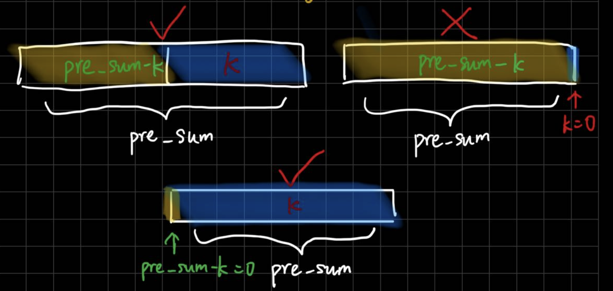

```python
def subarraySum(self, nums: List[int], k: int) -> int:
    cnt = 0 # 答案个数
    pre_sum = 0 # 前缀和
    hashmap = {0: 1} # 注意：前缀和为0出现了1次，如果不加会漏掉pre_sum=k的情况
    for i in range(len(nums)):
        pre_sum += nums[i]
        # 应该先判断pre_sum-k，再把pre_sum存入哈希表
        # 如果先把pre_sum存入哈希表，当k=0时，在hashmap中找pre_sum-k的时候就会找到自己，导致 这个和为K的子数组 是个空数组，而不是一个 和为0的子数组。
        if pre_sum-k in hashmap:
            cnt += hashmap[pre_sum-k] # 注意：不是k-pre_sum
        if pre_sum not in hashmap: # 这部分和上一个if顺序不能换
            hashmap[pre_sum] = 0
        hashmap[pre_sum] += 1
    return cnt
```

## 矩阵

#### [289. Game of Life](https://leetcode.com/problems/game-of-life/)（生命游戏）

> 题意：给一个二维矩阵，0表示死细胞，1表示活细胞，并给出一系列规则：
>
> 1. 少于两个活邻居的活细胞都会死亡
> 2. 有两个或三个邻居的活细胞都会生存到下一代
> 3. 有超过三个邻居的活细胞都会死亡
> 4. 有恰好三个活邻居的死细胞都会变成活细胞
>
> 求如何用O(1)空间得到这个二维矩阵的下一时刻的状态
>
> 思路：进阶要求用原地算法，`O(1)`空间就是需要用额外的状态标识现在、以前的状态。
>
> 因此新增状态：死->活为2，活->死为3

```python
def gameOfLife(self, board: List[List[int]]) -> None:
    """
    Do not return anything, modify board in-place instead.
    """
    m, n = len(board), len(board[0])
    directions = [[-1,-1],[-1,0],[-1,1],[0,-1],[0,1],[1,-1],[1,0],[1,1]]
    def get_nums_alive(i, j): # 统计周围活细胞数量
        cnt = 0
        for direction in directions:
            next_i = i + direction[0]
            next_j = j + direction[1]
            if next_i < 0 or next_i >= m or next_j < 0 or next_j >= n: # 出界
                continue 
            if board[next_i][next_j] == 1 or board[next_i][next_j] == 3: # 如果当前状态是活的
                cnt += 1
        return cnt

    for i in range(m):
        for j in range(n):
            cnt = get_nums_alive(i, j)
            if board[i][j] == 1: # 当前是活细胞
                if cnt < 2:
                    board[i][j] = 3 # 状态3：活->死
                elif cnt == 2 or cnt == 3:
                    board[i][j] = 1 # 状态1：继续活
                else:
                    board[i][j] = 3 # 状态3：活->死
            else: # 当前是死细胞
                if cnt == 3:
                    board[i][j] = 2 # 状态2: 死->活
    # 更新结果，把状态2和3改为状态0和1
    for i in range(m):
        for j in range(n):
            if board[i][j] == 2:
                board[i][j] = 1
            elif board[i][j] == 3:
                board[i][j] = 0

```

#### [240. Search a 2D Matrix II](https://leetcode.com/problems/search-a-2d-matrix-ii/)（搜索二维矩阵2）

> 题意：在二维矩阵中搜索一个数，与74.搜索二维矩阵不同，本题没有确保「每行的第一个整数大于前一行的最后一个整数」，因此不能使用二分。
>
> 思路：右上角的元素是这一行中最大的元素，同时又是这一列中最小的元素。比较右上角元素和目标：
>
> - 若右上角元素等于目标，则找到
> - 若右上角元素大于目标，则目标不可能存在于当前矩阵的最后列，则可以去掉最后列 `j-=1`
> - 若右上角元素小于目标，则目标不可能存在于当前矩阵的第一行，则可以去掉第一行 `i+=1`
> - 若最后矩阵减小为空，则说明不存在
>
> 实际上就是利用i和j的移动一步步缩小搜索矩阵，从右上角或左下角开始都可以，原因是当大于target或小于target时，要去掉一行或一列。而左上角或右下角不行。

```python
def searchMatrix(self, matrix: List[List[int]], target: int) -> bool:
    m, n = len(matrix), len(matrix[0])
    i, j = 0, n-1
    while i < m and j >=0:
        if matrix[i][j] == target:
            return True
        elif matrix[i][j] > target:
            j -= 1
        else:
            i += 1
    return False
```

## 栈

#### [20. Valid Parentheses](https://leetcode.com/problems/valid-parentheses/)（有效括号）

> 题意：easy题。给一个有各种括号的字符串，如：`"()[]{}"`，判断是否是有效字符串。
>
> 思路：用栈实现。用字典存左右括号对应关系。
>
> - 注意：检查循环中 and 循环后 栈是否为空

```python
def isValid(self, s: str) -> bool:
    stack = []
    hashmap = {'(':')', '[':']', '{':'}'}
    for c in s:
        if c in '([{':
            stack.append(c)
        else:
            if not stack:
                return False
            top = stack.pop(-1)
            if hashmap[top] != c:
                return False

    return False if stack else True # 如果栈中还有元素也是False
```

#### [32. Longest Valid Parentheses](https://leetcode.com/problems/longest-valid-parentheses/)

> 题意：hard题。求最长连续的括号。注意：不能用20题的解法，否则 `（）（（））`，这种只能得到长度4，而题意要求是6，因为这些括号是连续的。
>
> 思路：从左到右遍历，用两个变量left和right统计当前遇到的左括号和右括号数，当数量相等时，才更新最长长度(left + right)，当右括号数量更多时，要把left和right都置零，表示重新开始。
>
> 然后还要用同样的思路，从右往左遍历，当数量相等时，更新最长长度。当左括号数量更多时，把left和right都置零，表示重新开始。

```python
def longestValidParentheses(self, s: str) -> int:
    l, r = 0, 0
    max_len = 0
    # 从左到右遍历
    for i in range(len(s)):
        if s[i] == '(':
            l += 1
        else:
            r += 1
  
        if l < r:
            l, r = 0, 0
        elif l == r: # 只有相等时可以更新
            max_len = max(max_len, l + r)
        # l > r时不能更新，原因是不清楚括号的对数
    # 从右往左遍历，为了防止（）（（（））这种，在正向遍历中只能得到2的长度
    l, r = 0, 0
    for i in range(len(s)-1, -1, -1):
        if s[i] == '(':
            l += 1
        else:
            r += 1

        if l > r:
            l, r = 0, 0
        elif l == r:
            max_len = max(max_len, l + r)
    return max_len 
  
```

#### [155. Min Stack](https://leetcode.com/problems/min-stack/)（最小栈）

> 题意：设计一个最小栈，要求在常数时间内获得栈中的最小值，因此不能在 `getMin()` 的时候再去计算最小值，最好应该在 `push` 或者 `pop` 的时候就已经计算好了当前栈中的最小值
>
> 思路：因此不能在 `getMin()` 的时候再去计算最小值，最好应该在 `push` 或者 `pop` 的时候就已经计算好了当前栈中的最小值。
>
> 1. 新元素入栈：
>    * 当栈为空，入栈元组 `(x, x)`；
>    * 当栈不空，入栈元组 `(x, min(此前栈内最小值, x))`
> 2. 出栈：删除栈顶的元组
> 3. 获取栈内最小值：栈顶元组里保存了当前栈内最小值
>
> 因此，栈顶元素保存的是 `(x, 当前栈内最小值)`，能在 `pop`的时候同时获得这两个元素

```python
class MinStack:
    def __init__(self):
        self.min_stack = []

    def push(self, val: int) -> None:
        if not self.min_stack:
            self.min_stack.append((val, val))
        else:
            cur_min = min(val, self.min_stack[-1][1])
            self.min_stack.append((val, cur_min))

    def pop(self) -> None:
        self.min_stack.pop(-1)
  
    def top(self) -> int:
        return self.min_stack[-1][0]
  

    def getMin(self) -> int:
        return self.min_stack[-1][1]
  
# Your MinStack object will be instantiated and called as such:
# obj = MinStack()
# obj.push(val)
# obj.pop()
# param_3 = obj.top()
# param_4 = obj.getMin()
```

#### [394. Decode String](https://leetcode.com/problems/decode-string/)

> 题意：把字符串解码，如： `3[a]2[bc]->aaabcbc`，括号前的数字的重复的次数，括号内部是要重复的内容。而且可能有嵌套括号。
>
> 思路：和 `224. 基本计算器做法`基本一样。

```python
def decodeString(self, s: str) -> str:
    res = '' # res: 当前括号中的结果，上一个（外层）括号中的结果在栈中
    cnt = 0 # cnt：下一个括号要重复的次数
    stack = [] # 存放res和cnt
    for c in s:
        if c.isdigit(): # 碰到连续的数字，就累加起来
            cnt = cnt * 10 + int(c)
        elif c.isalpha(): # 碰到字母，就计入当前结果
            res += c
        elif c == '[': # 左括号
            stack.append(res) # 括号前的结果入栈
            stack.append(cnt) # 括号前的数字（记录括号内内容的重复次数）入栈
            res = '' # 开始统计括号内的结果和次数，因此res和cnt要清空
            cnt = 0
        elif c == ']':
            cnt = stack.pop(-1) # 弹出左括号前入栈的次数（记录括号内重复次数）
            pre_res = stack.pop(-1) # 弹出左括号前入栈的结果
            res = pre_res + cnt * res # 之前结果 + 括号内次数 * 括号内结果
            cnt = 0 # 清空次数
            # res不用清空，他会继续和后面拼接
    return res
  
```

#### [224. Basic Calculator](https://leetcode.com/problems/basic-calculator/)（基本计算器）

> 题意：写一个计算器，只带 `+ -`运算符，但是有括号 `()`。hard题
>
> 思路：遇到左括号，说明遇到右边表达式，碰到右括号，说明右边表达式结束。说明：左边表达式按顺序就会计算到，因此不会带括号。遇到右边表达式的时候，即遇到 `'('`，应该把左边的结果和符号（这个左括号前的符号）入栈（并清零）。然后 `res`从 `0`开始计算当前括号中的结果。右边表达式结束时，把栈中结果和符号弹出和当前 `res`计算。
>
> - 注意：碰到符号或右括号时，都是对上一个表达式进行计算。因此，会漏掉表达式最后一个数，因此在尾部加入一个哨兵 `$`，便于对最后一个表达式进行计算。
> - 重置变量：
>   - 算完前一个表达式后要重置num和sign（碰到符号和右括号时都会计算前一个表达式）。碰到右括号算完后，不要把当前结果res入栈。
>   - 当前结果res和当前符号sign入栈后要重置res和sign。
>
> [负雪明烛思路](https://leetcode.cn/problems/basic-calculator/solutions/646800/ru-he-xiang-dao-yong-zhan-si-lu-lai-zi-y-gpca)

```python
def calculate(self, s: str) -> int:
    res = 0 # res: 当前括号中的计算结果，上一个（外层）括号中的计算结果在栈中
    num = 0 # num：当前数字
    sign = 1 # sign: 前一个数运算符
    stack = []
    s += '$' # 添加哨兵节点，单独处理最后一个数
    for c in s:
        if c.isdigit():
            num = 10 * num + int(c)
        elif c in '+-$': # 还有个哨兵节点
            res += sign * num
            num = 0 # 算完一个表达式后重置num
            sign = 1 if c == "+" else -1 # 重置sign
        elif c == "(":
            stack.append(res) # 括号前的结果
            stack.append(sign) # 括号前的加减号
            res = 0 # 只有在这需要将res置零，因为入栈了
            sign = 1
        elif c == ")":
            res += sign * num
            res *= stack.pop(-1)
            res += stack.pop(-1)
            # 不需要把res入栈，他会作为当前结果继续和后面计算，因此也不要把res置零
            num = 0
            sign = 1
    return res

```

#### [227. Basic Calculator II](https://leetcode.com/problems/basic-calculator-ii/)（基本计算器2）

> 题意：写一个计算器，有 +， - ，*，/ 四种运算符，没有括号。medium题。
>
> 思路：把所有的 *，/ 先计算出来，最后计算只有 +， - 运算符的表达式。
>
> 注意：在程序中，碰到当前符号时，说明要进行运算or栈操作。这时，我们要判断前一个符号(而非当前符号)来决定是个什么表达式。如 `1+33+`，遇到最后一个 `+` 的时候，判断前一个符号是 `*`，才知道要算的是 `3*3`。
>
> - `+-` 是一元运算符，只要前一个运算符 `pre_op`和当前数字 `num`就能计算：
>   - 如：`+1-3+`，`+1`可以直接算，`-3`可以直接算。
> - `*/` 是二元运算符，所以不仅要前一个运算符 `pre_op`和当前数字 `num`，还需要从栈里弹出上一个操作数。
>   - 如：`2*3+`，`pre_op`是 `*`，`num`是 `3`，还需要从栈里弹出 `2`，计算完把结果再入栈
>
> 注意：初始的 `pre_op`设置为 `+` ，保证第一个操作数正常入栈。本题也要在末尾加一个哨兵 `$`，保证对最后一个表达式的计算。
>
> [负雪明烛思路](https://leetcode.cn/problems/basic-calculator-ii/solutions/648941/xian-cheng-chu-zai-jia-jian-yong-zhan-ba-hplr)

```python
def calculate(self, s):
    num = 0
    pre_op = '+'
    stack = [] # 栈里只保存需要+运算的数，-运算的数加负号后入栈，*/运算的数算完结果后入栈。当有一连串*/运算时，不断弹出栈顶元素，计算后再压入栈。
    s += '$' # 添加哨兵节点，单独处理最后一个数
    for c in s:
        if c.isdigit():
            num = 10 * num + int(c)
        elif c in '+-*/$': # $表示到最后一个数
            # 注意：判断的是前一个符号不是当前符号，因为这样才能得到一个完整表达式
            if pre_op == '+':
                stack.append(num)
            elif pre_op == '-':
                stack.append(-num)
            elif pre_op == '*':
                top = stack.pop() # 弹出来
                stack.append(top * num) # 算完再入栈
            elif pre_op == '/':
                top = stack.pop()
                if (top > 0 and num > 0) or (top < 0 and num < 0):
                    stack.append(top // num)
                else: # python中负数除法地板除结果会更小，而答案要更接近0
                    stack.append(int(top / num)) # 所以单独处理
            pre_op = c # 把当前的运算符 赋给 之前的运算符
            num = 0 # 碰到符号，说明有数字被压入栈，因此当前数字要清零
    return sum(stack) # 最后栈里存的都是+-操作的数，直接求和就是答案
```

## 单调栈

#### [739. Daily Temperatures](https://leetcode.com/problems/daily-temperatures/)（每日温度）

> 解析还没写

```python
def dailyTemperatures(self, temperatures: List[int]) -> List[int]:
    res = [0 for i in range(len(temperatures))]
    stack = []
    stack.append(0)
    for i in range(1, len(temperatures)):
        if temperatures[i] > temperatures[stack[-1]]:
            while stack and temperatures[i] > temperatures[stack[-1]]:
                res[stack[-1]] = i - stack[-1]
                stack.pop(-1)
            stack.append(i)
        else:
            stack.append(i)
    while stack: # 这段可以忽略，因为这些元素在初始化时已经赋值过了
        res[stack[-1]] = 0
        stack.pop(-1)
    return res
```

#### 单调队列题目见 [239. Sliding Window Maximum](https://leetcode.com/problems/sliding-window-maximum/)

## 链表

#### [86. Partition List](https://leetcode.com/problems/partition-list/)（分隔链表）

> 题意：给一条链表，把所有 `'值<x的节点'`放到 `'值≥x的节点'`前面，且保持两个分区中节点相对位置不变
>
> 思路：新增两个 `dummy`节点，一个把值小的节点串起来，另一个把值大的节点串起来。最后把两串拼成一串。

```python
def partition(self, head: Optional[ListNode], x: int) -> Optional[ListNode]:
    small_dummy = ListNode()
    big_dummy = ListNode()
    cur = head
    cur_small, cur_big = small_dummy, big_dummy
    while cur:
        if cur.val < x:
            cur_small.next = cur
            cur_small = cur_small.next
        else:
            cur_big.next = cur
            cur_big = cur_big.next
        cur = cur.next
    cur_small.next = big_dummy.next # 把大的那一串拼在小的那一串后面
    cur_big.next = None # 注意：要加上这句，不然cur_big可能还连着其他节点，就变成循环链表了，会出错
    return small_dummy.next
```

#### [146. LRU Cache](https://leetcode.com/problems/lru-cache/)（LRU缓存）

> 题意：实现LRU缓存
>
> 思路：用双向链表实现，头尾分别使用一个dummy节点。需要有一个 `lookup={}`用于通过 `key`来找 `node`。
>
> - 新增节点要放在表尾，这样保证最近访问的在表尾，最久之前访问的在表头。
>
>   1. 节点已存在时，要把旧的节点删掉
>   2. 节点数量超出限制时，要把表头节点删掉
>   3. 都删好后，再添加新节点
>
> * 获取 `val`时，要判断 `key`是否已经在 `lookup`中。若存在，就要把对应的 `node`先删掉，然后重新添加 `node`到链表中，保证其在表尾。

```python
# 创建双向链表
class Node:
    def __init__(self, key, val):
        self.key = key
        self.val = val
        self.prev = None
        self.next = None

class LRUCache:

    def __init__(self, capacity: int):
        # 构建首尾节点, 使之相连
        self.head = Node(0, 0)
        self.tail = Node(0, 0)
        self.head.next = self.tail
        self.tail.prev = self.head

        self.lookup = dict() # lookup作用是根据key找node
        self.max_len = capacity # 允许的最多节点数

    def get(self, key: int) -> int:
        if key in self.lookup: # 如果node存在
            node = self.lookup[key]
            self.remove(node) # 就先删掉
            self.add(node) # 再添加同样的节点，目的是让这个节点去链表尾部
            return node.val
        else:
            return -1

    def put(self, key: int, value: int) -> None:
        # 两个if顺序不能反，如果删掉本身后，还不够放，才要继续删
        if key in self.lookup: # 如果node存在，就删掉
            self.remove(self.lookup[key])
        if len(self.lookup) == self.max_len: # 如果数量超了，就删掉最不常用的节点
            # 把表头位置节点删除(最不常用的数据值)
            self.remove(self.head.next)
        self.add(Node(key, value)) # 删好后，添加节点
  
    # 需要自己新增的两个函数：
    # 1. 删除链表节点
    def remove(self, node):
        del self.lookup[node.key] # 在lookup中删除节点
        node.prev.next = node.next # 修改节点前后指针关系
        node.next.prev = node.prev
    # 2. 在链表尾添加节点
    def add(self, node):
        self.lookup[node.key] = node # 在lookup中添加节点
        prev_tail = self.tail.prev # 修改节点前后指针关系
        node.next = self.tail
        self.tail.prev = node
        prev_tail.next = node
        node.prev = prev_tail

# Your LRUCache object will be instantiated and called as such:
# obj = LRUCache(capacity)
# param_1 = obj.get(key)
# obj.put(key,value)
```

## 树

#### [114. Flatten Binary Tree to Linked List](https://leetcode.com/problems/flatten-binary-tree-to-linked-list/)（二叉树展开为链表）

> 题意：把一棵树变成一个链表，每个节点都放在右孩子指针，且顺序要和前序遍历一样
>
> 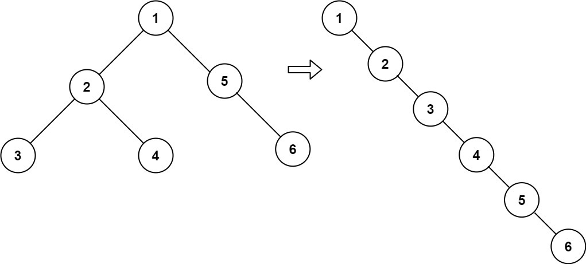
>
> 思路：就是要让每个节点都没有左孩子，我们可以用一种迭代的方式把所有节点的左子树放到右子树中（且要保持按前序遍历的顺序）。对于一个节点 `root`来说，其左子树的前序遍历的最后一个节点是左子树的最右孩子 `t`，然后，我们把整个右子树接到这个最右孩子的 `right`上。这样，就在保持前序遍历顺序的同时，把整个右子树移到左子树了。接下来，我们把整个左子树移到右子树就OK了。至此，`root`就只有右子树了（且符合前序遍历顺序）。我们再迭代到 `root.right`，把它作为 `root`，继续这个过程，直到 `root`不存在。这样就完成了整棵树的链表化。
>
> 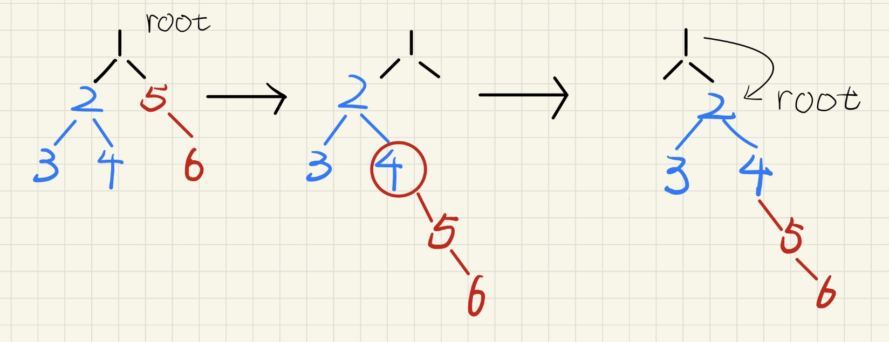

```python
def flatten(self, root: Optional[TreeNode]) -> None:
    """
    Do not return anything, modify root in-place instead.
    """
    while root:
        if root.left: #左子树存在的话才进行操作
            sub_left = root.left
            while sub_left.right: #左子树的右子树找到最深
                sub_left = sub_left.right 
            sub_left.right = root.right # 将root的右子树挂到左子树的右子树的最深
            root.right = root.left # 将root的左子树挂到右子树
            root.left = None #将root左子树清空
        root = root.right # 继续下一个节点的操作

```

#### [543. Diameter of Binary Tree](https://leetcode.com/problems/diameter-of-binary-tree/)（二叉树的直径）

> 题意：找二叉树的直径，直径是任意两个节点之间的最长距离（可能不经过 `root`）
>
> 思路：dfs过程中，对于每一个节点，都把他看做 `root`，求以它为中心时，左右子树的高度和，这就是这个节点的直径。dfs每个节点的过程中，我们需要用一个变量，取所有节点直径的最大值。

```python
def diameterOfBinaryTree(self, root: Optional[TreeNode]) -> int:
    res = 0
  
    def dfs(node):
        if not node:
            return 0
        l_depth = dfs(node.left)
        r_depth = dfs(node.right)
        nonlocal res
        res = max(res, l_depth + r_depth) # 去掉这一行的话就是求二叉树高度
        return max(l_depth, r_depth) + 1
  
    dfs(root)
    return res
```

#### [124. Binary Tree Maximum Path Sum](https://leetcode.com/problems/binary-tree-maximum-path-sum/)（二叉树中的最大路径和）

> 题意：求一条路径，使得这条路径上所有值的和是最大的（路径可能不经过root）
>
> 思路：这题和543.二叉树的直径很像，都是求一条路径，路径可能不经过 `root`，做法也类似，dfs过程中，对于每一个节点，都把他看做 `root`，求以它为中心时，左右子树最大的路径和。dfs每个节点的过程中，我们需要用一个变量，取所有节点路径和的最大值。

```python
def maxPathSum(self, root: Optional[TreeNode]) -> int:
    res = -float('inf') # 初始化为最小值

    def dfs(node):
        if not node:
            return 0 # 没有节点，和为 0
        l_sum = dfs(node.left) # 左子树最大链和
        r_sum = dfs(node.right) # 右子树最大链和
        nonlocal res
        res = max(res, l_sum + r_sum + node.val) # 选该节点作为链的中心，因此两个孩子的sum都要用上，两条链拼成路径
        return max(max(l_sum, r_sum) + node.val, 0) # 返回时，该节点作为孩子，所以只能带上他的一个最大的孩子
        # 这里要注意的是，如果两个孩子都是负值，会舍弃掉两个孩子，因此和0求max
  
    dfs(root)
    return res
```

## 图

#### [133. Clone Graph](https://leetcode.com/problems/clone-graph/)（克隆图）

> 题意：深拷贝一个图（图是用指针串起来的，每个node都有个neighors属性，是个list，装了邻接的node指针）
>
> 
>
> 思路：可以用DFS/BFS，建议用DFS，更好理解，138是本题的链表版本，做法基本一样，也建议用DFS做
>
> 用一个visted字典存 旧节点 -> 新节点
>
> 有一点需要注意：为什么dict中可以保存可变的对象？Claude的解释：对象的哈希值默认基于其地址。
>
> 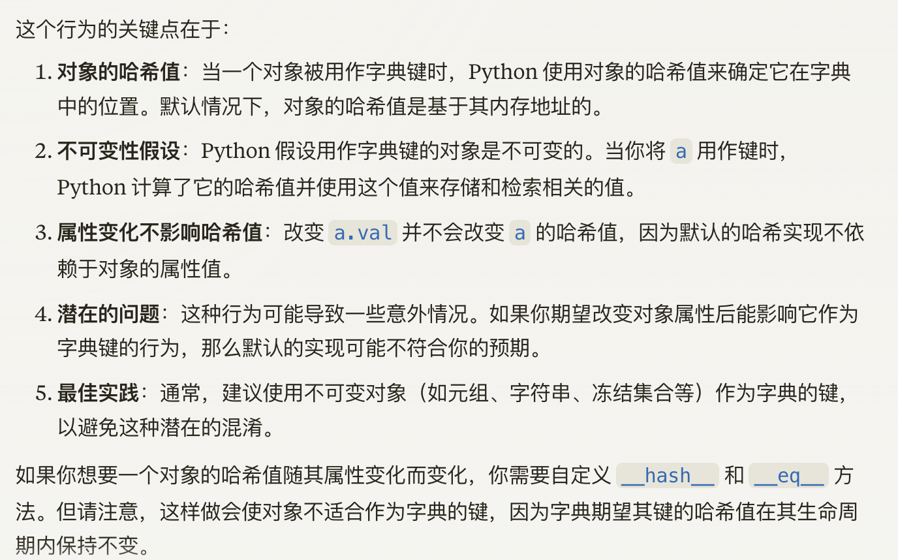

- DFS

```python
def cloneGraph(self, node: Optional['Node']) -> Optional['Node']:
    # 题意：深拷贝一个图（图是用指针串起来的）
    # 思路：可以用DFS/BFS，建议用DFS，更好理解
    # 138是本题的链表版本，做法基本一样，也建议用DFS做
    # DFS
    visited = {}
    def dfs(node): # dfs的作用是深拷贝一个节点，返回深拷贝后的新节点
        if not node: 
            return None
        if node in visited:
            return visited[node]
        clone_node = Node(node.val, [])
        visited[node] = clone_node
        for neighbor in node.neighbors:
            clone_neighbor = dfs(neighbor)
            clone_node.neighbors.append(clone_neighbor)
            # or visited[node].neighbors.append(clone_neighbor) 
            # 因为clone_node是指针，所以clone_node和visited[node]是同一个对象
        return clone_node

    return dfs(node
```

- BFS（不建议使用）

```python
def cloneGraph(self, node: Optional['Node']) -> Optional['Node']:
    if not node:
        return None

    visited = {}
    queue = [node]
    clone_node = Node(node.val, [])
    visited[node.val] = clone_node
    while queue:
        for i in range(len(queue)):
            n = queue.pop(0)
            for neighbor in n.neighbors:
                if neighbor.val not in visited:
                    clone_neighbor = Node(neighbor.val, [])
                    visited[neighbor.val] = clone_neighbor
                    queue.append(neighbor)
                visited[n.val].neighbors.append(visited[neighbor.val])
    return visited[node.val]
```

#### [138. Copy List with Random Pointer](https://leetcode.com/problems/copy-list-with-random-pointer/)（随机链表的复制）

> 题意：深拷贝一个链表，每个节点有两个指针(`next`和 `random`)，是 `133`的链表版本
>
> 思路：做法和133基本一样，可以用DFS/BFS，但DFS更好理解，因此只提供DFS解法
>
> 用一个visted字典存 旧节点 -> 新节点

```python
def copyRandomList(self, head: 'Optional[Node]') -> 'Optional[Node]':
    # 题意：深拷贝一个链表，每个节点有两个指针(next和random)，是133的链表版本
    # 思路：做法和133基本一样，可以用DFS/BFS，但DFS更好理解，因此只提供DFS解法
    # 用一个visted字典存 旧节点 -> 新节点
    visited = {}
    def dfs(node):
        if not node:
            return None
        if node in visited:
            return visited[node]
        clone_node = Node(node.val, None, None) # 生成新节点
        visited[node] = clone_node # 在visited标记新节点
        clone_node.next = dfs(node.next) # 更新clone_node.next
        clone_node.random = dfs(node.random) # 更新clone_node.random
        return clone_node
    return dfs(head)

```

#### [994. Rotting Oranges](https://leetcode.com/problems/rotting-oranges/)（腐烂的橘子）

> 题意：给一个矩阵，`0`表示空格，`1`表示新鲜橘子，`2`表示腐烂橘子。每1分钟，腐烂橘子可以把周围 `4`个方向的新鲜橘子变腐烂。问最少几分钟，能腐烂所有橘子，如果无法腐烂所有橘子，返回 `-1`。
>
> 思路：本题不需要用BFS，用 `3`个集合记录新鲜橘子 `fresh`、上一轮腐烂的橘子 `rotten`、准备腐烂的橘子 `new_rotten`。
>
> 只要有新鲜橘子就进行循环，遍历上一轮腐烂的橘子，增加准备腐烂的橘子。本次循环后，用过的上一轮腐烂的橘子就已经完全没用了。每次循环记录一分钟。当新鲜橘子还存在，但没有准备腐烂的橘子时，说明不可能把所有新鲜橘子都腐烂了。

```python
def orangesRotting(self, grid: List[List[int]]) -> int:
    m, n = len(grid), len(grid[0])
    fresh, rotten = set(), set() # 新鲜橘子，上一轮腐烂的橘子
    res = 0
    directions = [[-1,0], [1,0], [0,-1], [0,1]]
    for i in range(m):
        for j in range(n):
            if grid[i][j] == 1:
                fresh.add((i, j)) # 记录新鲜橘子
            elif grid[i][j] == 2:
                rotten.add((i, j)) # 记录上一轮腐烂的橘子
    while fresh: # 只要存在新鲜橘子
        res += 1 # 分钟+1
        new_rotten = set() # 新一轮准备腐烂的橘子
        for i, j in rotten: # 遍历上一轮腐烂的橘子，更新准备腐烂的橘子
            for direction in directions:
                next_i = i + direction[0]
                next_j = j + direction[1]
                if 0<=next_i<m and 0<=next_j<n and (next_i, next_j) in fresh:
                    new_rotten.add((next_i, next_j))
                    fresh.remove((next_i, next_j)) # 从新鲜橘子里删掉
        if not new_rotten: # 没有准备腐烂的橘子，说明没法继续扩散了
            return -1
        rotten = new_rotten # 把准备腐烂的橘子 设置为 当前腐烂的橘子进入下次循环
    return res # 退出循环，说明都腐烂完了，返回分钟数
  
```

#### [79. Word Search](https://leetcode.com/problems/word-search/)（单词搜索）

> 题意：给一张二维数组，每个位置存一个字母，求能不能拼成一个给定单词。
>
> 思路：因为本题求是否存在一条路径，因此访问过的标记visited要撤销。
>
> 这题需要回溯，因此不能使用BFS。

```python
def exist(self, board: List[List[str]], word: str) -> bool:
    # 这题需要回溯，因此不能使用BFS
    m, n = len(board), len(board[0])
    visited = [[False for j in range(n)] for i in range(m)]
    directions = [[0, 1], [0, -1], [1, 0], [-1, 0]]
    def is_valid(i, j, idx): # 检查是否越界、是否访问过、单词是否合规
        if 0 <= i < m and 0 <= j < n and board[i][j] == word[idx] and not visited[i][j]:
            return True
        return False
    def dfs(i, j, cur_idx):
        if cur_idx == len(word) - 1:
            return True
        for direction in directions:
            next_i = i + direction[0]
            next_j = j + direction[1]
            if is_valid(next_i, next_j, cur_idx + 1):
                visited[next_i][next_j] = True
                if dfs(next_i, next_j, cur_idx + 1):
                    return True
                visited[next_i][next_j] = False
        return False

    for i in range(m):
        for j in range(n):
            if is_valid(i, j, 0) and not visited[i][j]:
                visited[i][j] = True
                if dfs(i, j, 0):
                    return True
                visited[i][j] = False
    return False
```

#### [200. Number of Islands](https://leetcode.com/problems/number-of-islands/)（岛屿数量）

> 题意：求岛屿数量
>
> 思路：用DFS、BFS都可以，访问过的要标记visited，且不用撤销

```python
def numIslands(self, grid: List[List[str]]) -> int:
    m, n = len(grid), len(grid[0])
    visited = [[0 for j in range(n)] for i in range(m)]
    directions = [(0, 1), (1, 0), (-1, 0), (0, -1)]
    def is_valid(x, y): # 检查是否越界、是否访问过、是否为地面
        if 0 <= x < m and 0 <= y < n and grid[x][y] == '1' and visited[x][y] == 0:
            return True
        else:
            return False
    # bfs解法
    def bfs(x, y):
        queue = []
        visited[x][y] = 1
        queue.append((x, y))
        while queue:
            for i in range(len(queue)):
                x, y = queue.pop(0)
                for j in range(4):
                    next_x = x + directions[j][0]
                    next_y = y + directions[j][1]
                    if is_valid(next_x, next_y):
                        visited[next_x][next_y] = 1
                        queue.append((next_x, next_y))
    res = 0
    for i in range(m):
        for j in range(n):
            if is_valid(i, j):
                bfs(i, j)
                res += 1
    return res
  
    # dfs解法 代码量更少
    def dfs(x, y):
        for i in range(4):
            next_x = x + directions[i][0]
            next_y = y + directions[i][1]
            if is_valid(next_x, next_y):
                visited[next_x][next_y] = 1
                dfs(next_x, next_y)
    res = 0
    for i in range(m):
        for j in range(n):
            if is_valid(i, j):
                visited[i][j] = 1
                dfs(i, j)
                res += 1
    return res  
```

#### [909. Snakes and Ladders](https://leetcode.com/problems/snakes-and-ladders/)（蛇梯棋）

> 题意：类似于飞行器，左下角是起点，之字形走，一次可以走1~6个格子，有特殊格子是蛇或者梯子，这种特殊的格子是可以瞬移的，问最少要几步能走到终点(起点和终点没有蛇和梯子)。
>
> 思路：用BFS做，BFS的特性就是第一次到终点的一定是距离最短的
>
> 注意：编号从1开始，获取行、列的时候，要小心处理

```python
def snakesAndLadders(self, board: List[List[int]]) -> int:
    # 题意：类似于飞行器，左下角是起点，之字形走，一次可以走1~6个格子，有特殊格子是蛇或者梯子，这种特殊的格子是可以瞬移的，问最少要几步能走到终点(起点和终点没有蛇和梯子)
    # 思路：用BFS做，BFS的特性就是第一次到终点的一定是距离最短的
    # 注意：编号从1开始，获取行、列的时候，要小心处理
    n = len(board) # 获取方阵的边长，长宽一样
    target = n * n # 获取方阵尺寸，也是最后要到达目的地
    queue = [1] # 存放方格编号
    cnt = 0 # 存放到当前点的距离
    visited = [[False for j in range(n)] for i in range(n)]
    visited[n-1][0] = True
    while queue:
        cnt += 1 # 移动数加1
        for _ in range(len(queue)): 
        # 在for循环内的距离都一样，到下次while循环要多走一步
            curr = queue.pop(0) # 获取队首的方格编号和到达该方格的最少移动数
            for i in range(curr + 1, min(curr + 6, target) + 1):
                row = (n-1) - (i-1) // n # 因为编号是从1开始的，所以要用(i-1)//n
                if ((n-1) - row) % 2 == 0: # 说明i这行也是从左到右的
                    col = (i-1) % n
                else: # 说明i这行是从右到左的
                    col = (n-1) - (i-1) % n
                if not visited[row][col]: # 跳过搜索过的编号
                    visited[row][col] = True # 标记该编号已搜索
                    if board[row][col] != -1: # 特殊格子，进行传送
                        next_i = board[row][col]
                    else: # 普通格子，不动
                        next_i = i
                    if next_i == target: # 到达终点，直接返回最小移动数 
                        return cnt
                    queue.append(next_i) # 加入队列
    return -1 # 退出循环说明没有到达目的地
```

#### [433. Minimum Genetic Mutation](https://leetcode.com/problems/minimum-genetic-mutation/)（最小基因变化）

> 题意：和 `127. Word Ladder`基本一样，从一个字符串变到另一个字符串最少需要几步（每次最多变一个字符，且中间状态都得在 `bank`里）
>
> 思路：用BFS做，BFS的特性是找到终点时，一定是最短路径
>
> 注意：`startGene`不一定在 `bank`里，但默认是有效的，`endGene`如果不在 `bank`里就无效

```python
def minMutation(self, startGene: str, endGene: str, bank: List[str]) -> int:
    queue = [startGene]
    visited = set()
    visited.add(startGene)
    cnt = 0
    available_genes = ['A', 'C', 'G', 'T']
    while queue:
        cnt += 1
        for _ in range(len(queue)):
            gene = queue.pop(0)
            gene2list = list(gene) # python字符串不能修改，因此先转list
            for i in range(8): # 遍历每一位
                for j in range(4): # 把每一位分别替换成A/C/G/T
                    gene2list[i] = available_genes[j]
                    new_gene = ''.join(gene2list) # 重新串成str
                    if new_gene not in visited and new_gene in bank: # 检查是否是合格状态
                        visited.add(new_gene)
                        queue.append(new_gene)
                        if new_gene == endGene: # 到达终点
                            return cnt
                gene2list[i] = gene[i] # 注意：第i位要复原
    return -1 # 没找到
```

#### [127. Word Ladder](https://leetcode.com/problems/word-ladder/)（单词接龙）

> 题意：和433. Minimum Genetic Mutation基本一样，从beginWord变换到endWord，每次只能变换一个字符，且每个变换后的中间状态都要在wordList中，最少需要变换几次，只要求次数，不要路径（不要做成编辑距离，编辑距离对中间状态没要求）
>
> 思路：无向图求最短路，BFS最为合适，BFS只要搜到了终点，那么一定是最短的路径。
>
> 对每个单词w，分别遍历其每一位字符，改成其他字母。对每个单词w，后续处理的时间复杂度是 单词的长度*26（因为每次只改变一位）
>
> 2个注意点：
>
> 1. 本题是一个无向图，需要用标记位，标记着节点是否走过，否则就会死循环！
> 2. 本题给出集合是数组型的，可以转成set结构，查找更快一些

```python
def ladderLength(self, beginWord: str, endWord: str, wordList: List[str]) -> int:  
    visited = set()
    def bfs():
        res = 1 # 初始单词也计入路径长度
        word_len = len(beginWord) # 所有单词长度都一样
        queue = []
        visited.add(beginWord) # set类型，单词添加后表示访问过了
        queue.append(beginWord)
        while queue:
            res += 1 # BFS到达下一圈，路径长度+1
            for _ in range(len(queue)):
                word = queue.pop(0)
                word2list = list(word) # python无法直接修改字符串，要先变为list，修改后再拼回去
                for i in range(word_len): # 分别修改每一位，只能修改一位，因此当前位修改完要复原
                    for j in range(26):
                        word2list[i] = chr(ord('a') + j) # 修改第i位
                        next_word = ''.join(word2list) # 拼回str
                        if next_word in wordList: # 新单词在List中
                            if next_word == endWord: # 找到结果
                                return res # 返回路径长度
                            if next_word not in visited: # 没访问过则可以作为下一圈的节点
                                visited.add(next_word)
                                queue.append(next_word)
                    word2list[i] = word[i] # 修改完第i位，要复原
        return 0 # bfs搜完还找不到的情况下返回0

wordList = set(wordList) # 题目中说wordList中所有单词都不同是假的，不去重会超时
if endWord not in wordList: # 如果endWord不在List中，则不存在路径
    return 0
if beginWord in wordList:  # 题目中说beginWord可能在List中，产生两种情况，为了方便，直接删除
    wordList.remove(beginWord)
res = bfs()
return res
```

### 有向图

#### [207. Course Schedule](https://leetcode.com/problems/course-schedule/)（课程表）

[笨猪爆破组：课程表1](https://leetcode.cn/problems/course-schedule/solutions/250377/bao-mu-shi-ti-jie-shou-ba-shou-da-tong-tuo-bu-pai-)

> 这题是拓扑排序问题的模板题，拓扑排序就是特殊的BFS
>
> 题意：给出一堆课程，某些课程会有前置课程，求能否学习完所有课程
>
> 思路：其实就是一个有向无环图，把一个 有向无环图 转成 线性的排序 就叫 拓扑排序
>
> 先构建两个数据结构：
>
> 1. **入度数组**：课号 `0`到 `n-1`作为索引，通过遍历 `prerequisites`求出对应的初始入度。
> 2. **邻接表**：用哈希表记录依赖关系（也可以用二维矩阵，但有点大）
>    - **`key`**：课号
>    - **`value`**：依赖这门课的后续课（`list`）
>
> 接下来进行拓扑排序，这个过程很像 BFS：
>
> 1. 让入度为 `0` 的课进入队列，它们是能直接选的课。
> 2. 然后队列里的课逐个出列，出列代表着课被选，需要减小相关课的入度。
> 3. 如果相关课的入度新变为 `0`，安排它入列、再出列……直到没有入度为 `0` 的课可入列。

```python
def canFinish(self, numCourses: int, prerequisites: List[List[int]]) -> bool:
    in_degree = [0 for i in range(numCourses)] # 入度数组
    graph = {} # 邻接表，{key: pre, value: [post1, post2, ...]}
  
    for i in range(len(prerequisites)): # 构建 入度数组 和 邻接表
        post, pre = prerequisites[i][0], prerequisites[i][1]
        in_degree[post] += 1 # 构建 入度数组
        if pre not in graph:  # 构建 邻接表
            graph[pre] = [post]
        else:
            graph[pre].append(post)

    queue = [] # queue 队列中始终是【入度为 0 的课】在里面流动
    for i in range(len(in_degree)): # 所有入度为0的课入队列，作为队列BFS初始值
        if in_degree[i] == 0:
            queue.append(i) # 这里是i进队列，不是in_degree[i]进队列

    count = 0 # 用一个变量记录选课的数量
    while queue: # 传统BFS
        for i in range(len(queue)):
            pre = queue.pop(0) # 当前选的课，出列
            count += 1
            if pre in graph: # 确保pre有后续课，这步容易忘记加
                post_list = graph[pre] # 查看哈希表，看它 对应哪些后续课
                for post in post_list: 
                    in_degree[post] -= 1 # 将这些后续课的 入度 - 1，
                    if in_degree[post] == 0: # 如果有 减至 0 的
                        queue.append(post) # 就将它 推入 queue
    # 不再有新的入度 0 的课入列 时，此时 queue 为空，退出循环

    # 怎么判断能否修完所有课？有两种方法：
    # 1. BFS 结束时，如果仍有课的入度不为 0，无法被选，完成不了所有课。否则，能找到一种顺序把所有课上完。
    # 2. 或者：用一个变量count记录入列的顶点个数（也就是选课的数量），最后判断count是否等于总课程数。

    if count == numCourses: # 如果选课的数量等于总课程数，说明可以完成所有课程
        return True
    else:
        return False
  
    # 也可以检查是否还有元素入度不为0，如果有，则完成不了所有课
    # for i in range(len(in_degree)):
    #     if in_degree[i] != 0:
    #         return False
    # return True

```

- **总结：拓扑排序问题**

> 1. 根据依赖关系，构建邻接表、入度数组。
> 2. 选取入度为 `0` 的数据，根据邻接表，减小依赖它的数据的入度。
> 3. 找出入度变为 `0` 的数据，重复第 2 步。
> 4. 直至所有数据的入度为 `0`，得到排序，如果还有数据的入度不为 `0`，说明图中存在环。

- **拓扑排序 和 传统BFS 不一样的地方:**

> 1. 传统BFS：把出列节点的下一层子节点推入 `queue`，不加甄别
> 2. 拓扑排序：实施甄别和监控，新入度为 `0` 的先推入 `queue`

#### [210. Course Schedule II](https://leetcode.com/problems/course-schedule-ii/)（课程表2）

[笨猪爆破组：课程表2](https://leetcode.cn/problems/course-schedule-ii/solutions/250125/bao-mu-shi-ti-jie-tuo-bu-pai-xu-si-lu-zen-yao-yi-2)

> 题意：这题和 `207.课程表`的区别就是：
>
> - `207.课程表` 求能否完成所有课程的学习
> - 本题求的是 能完成课程的情况下，返回安排课程学习的顺序。如果不可能完成所有课程，返回一个空 `list`
>
> 思路：代码和 `207`基本一样，只要用一个 `list`按顺序记录BFS时进队列的课程就好了。如果不可能完成所有课程，返回 一个空list 。

```python
def findOrder(self, numCourses: int, prerequisites: List[List[int]]) -> List[int]:
    in_degree = [0 for i in range(numCourses)] # 入度数组
    graph = {} # 邻接表，{key: pre, value: [post1, post2, ...]}
  
    for i in range(len(prerequisites)): # 构建 入度数组 和 邻接表
        post, pre = prerequisites[i][0], prerequisites[i][1]
        in_degree[post] += 1 # 构建 入度数组
        if pre not in graph:  # 构建 邻接表
            graph[pre] = [post]
        else:
            graph[pre].append(post)

    queue = [] # queue 队列中始终是【入度为 0 的课】在里面流动
    res = [] # 存放结果
    for i in range(len(in_degree)): # 所有入度为0的课入队列，作为队列BFS初始值
        if in_degree[i] == 0:
            queue.append(i) # 这里是i进队列，不是in_degree[i]进队列

    while queue: # 传统BFS
        for i in range(len(queue)):
            pre = queue.pop(0) # 当前选的课，出列
            res.append(pre) # 在出队列的时候放入结果数组
            if pre in graph: # 确保pre有后续课，这步容易忘记加
                post_list = graph[pre] # 查看哈希表，看它 对应哪些后续课
                for post in post_list: 
                    in_degree[post] -= 1 # 将这些后续课的 入度 - 1，
                    if in_degree[post] == 0: # 如果有 减至 0 的
                        queue.append(post) # 就将它 推入 queue
    # 不再有新的入度 0 的课入列 时，此时 queue 为空，退出循环

    if len(res) == numCourses: # 如果选课的数量等于总课程数，说明可以完成所有课
        return res
    else:
        return []
```

#### [399. Evaluate Division](https://leetcode.com/problems/evaluate-division/)（除法求值）

> 题意：给一个数组 `equations`和一个数组 `values`，其中 `equations[i]=[Ai, Bi]`和 `values[i]`表示等式 `Ai/Bi=values[i]`。另外给一个数组 `queries`表示问题，其中 `queries[j]=[Cj, Dj]`表示第 `j`个问题，要我们求 `Cj/Dj=?`，要我们把每个问题的结果添加到 `list`里返回，要是有的问题无解，就添加 `-1`到 `list`里。
>
> 思路：先构建**带权有向图**，边的权重为 `被除数 / 除数` 的 `商`，然后使用BFS / DFS找到 **起点** 到 **终点** 的路径，每一步都要累积权重
>
> - 因为是带权有向图，所以要用字典嵌套字典来构建图 `{x1:{y1:w1, y2:w2}, x2:{y3:w3, y4:w4}}`，其中 `x`是被除数，`y`是除数，`w`是商

- BFS解法：[别人的BFS解法](https://leetcode.cn/problems/evaluate-division/solutions/2539446/javapython3cyan-du-you-xian-sou-suo-jian-uwy3)

> 由于在BFS过程中，不仅要找到下一个待搜索的节点【即当前节点的未处理邻节点】，还要得到到达这个待搜索节点时的权重积，因此入队节点要存储（节点,权重积）两个信息。

```python
def calcEquation(self, equations: List[List[str]], values: List[float], queries: List[List[str]]) -> List[float]:  
    graph = {}
    for i in range(len(equations)): # 构建带权有向图
        x, y, w = equations[i][0], equations[i][1], values[i]
        if x not in graph:
            graph[x] = {} # 存储x邻节点的哈希表
        graph[x][y] = w # 生成一条x指向y，权重为w的路径，表示x/y = w
        graph[x][x] = 1 # 生成一个指向自己、权重为1的路径，表示自己除自己等于1
        if y not in graph:
            graph[y] = {} # 存储y邻节点的哈希表
        graph[y][x] = 1 / w # 生成一条y指向x，权重为1/w的路径，表示y/x = 1/w
        graph[y][y] = 1 # 生成一个指向自己、权重为1的路径，表示自己除自己等于1
  
    res = []
    for q in queries: # 对于每个q，寻找从起点qx到终点qy的最短路径，并计算权重积
        found = False
        qx, qy = q[0], q[1]
        if qx not in graph or qy not in graph: # 如果起点或终点不在图里
            res.append(-1) # 找不到答案
            continue # 直接求下一组解
        queue = []
        queue.append([qx, 1]) # 初始将(起点, 1.0)入队
        visited = set()
        visited.add(qx) # # 存储已处理的节点
        while queue:
            # 因为不需要求层数，所以没必要再加一层for循环
            n = queue.pop(0) # 
            node, mul = n[0], n[1] # 获取当前节点，和当前累积的权重
            if node == qy: # 找到终点
                res.append(mul) # 把权重(商)加入res数组
                found = True # 找到了
                break # 细节：记得要退出循环
            # 因为建图时，双向边都添加了，因此node肯定在graph中，不用判断
            for neighbor in graph[node].keys(): # 获取node的所有邻居
                weight = graph[node][neighbor] # 得到边的权重
                if neighbor not in visited:
                    visited.add(neighbor)
                    # 细节：要把下一个节点 和 累积的权重一起入队
                    queue.append([neighbor, mul * weight]) 
        if not found: # 没找到的话，要加入-1
            res.append(-1)
    return res
```

- DFS解法：[别人的DFS解法](https://leetcode.cn/problems/evaluate-division/solutions/6384/xian-gou-zao-tu-zai-dfsde-pythonshi-xian-by-mai-ma)

```python
def calcEquation(self, equations: List[List[str]], values: List[float], queries: List[List[str]]) -> List[float]:
    # 建图过程和BFS一样
    graph = {}
    for i in range(len(equations)): # 构建带权有向图
        x, y, w = equations[i][0], equations[i][1], values[i]
        if x not in graph:
            graph[x] = {} # 存储x邻节点的哈希表
        graph[x][y] = w # 生成一条x指向y，权重为w的路径，表示x/y = w
        graph[x][x] = 1 # 生成一个指向自己、权重为1的路径，表示自己除自己等于1
        if y not in graph:
            graph[y] = {} # 存储y邻节点的哈希表
        graph[y][x] = 1 / w # 生成一条y指向x，权重为1/w的路径，表示y/x = 1/w
        graph[y][y] = 1 # 生成一个指向自己、权重为1的路径，表示自己除自己等于1

    def dfs(node, mul):
        if node == qy: # 找到终点
            return mul # 返回累积的权重(商)
        for neighbor in graph[node].keys(): # 获取node的所有邻居
            weight = graph[node][neighbor] # 获取当前边的权重
            if neighbor not in visited:
                visited.add(neighbor)
                v = dfs(neighbor, mul * weight) # 累积的权重 * 当前边的权重
                if v != -1: # 不等于-1，说明neighbor或它的子孙找到结果了
                    return v # 直接往上一层返回
        return -1 # 遍历所有邻居的结果，都找不到终点，就往上一层返回-1

    res = []
    for q in queries: # 对于每个q，寻找从起点qx到终点qy的最短路径，并计算权重积
        qx, qy = q[0], q[1]
        if qx not in graph or qy not in graph: # 如果起点或终点不在图里
            res.append(-1) # 找不到答案
            continue # 直接求下一组解
        visited = set()
        visited.add(qx)
        ans = dfs(qx, 1)
        res.append(ans)
    return res

```

## 字典树

#### [208. Implement Trie (Prefix Tree)](https://leetcode.com/problems/implement-trie-prefix-tree/)（实现前缀树）

> 题意：实现字典树（前缀树）
>
> 思路：字典树模板题
>
> 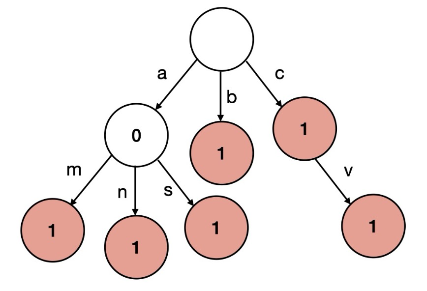
>
> Python 解法中，保存 孩子节点 是使用的字典，它保存的结构是 `{'a': {...}, 'b': {...}, 'c':{...}} `，所以可以直接通过 `node['a']`来获取当前节点的 `'a'`子树。
>
> - 叶子结点的 `node['#'] = {}`

```python
class Trie:
    # 字典树模板题
    def __init__(self):
        self.root = {} # root不存实际的东西，只存儿子节点

    def insert(self, word: str) -> None:
        node = self.root
        for c in word:
            if c not in node: # 找到了c
                node[c] = {} # 嵌套字典
            node = node[c] # 到儿子节点
        node['#'] = {} # 加上结束符

    def search(self, word: str) -> bool:
        node = self.root
        for c in word:
            if c not in node: # 找不到节点，就返回False
                return False
            node = node[c] # 获取儿子节点
        if '#' not in node: # 如果最终节点，没有结束符，也返回False
            return False
        else:
            return True

    def startsWith(self, prefix: str) -> bool:
        node = self.root
        for c in prefix:
            if c not in node:
                return False
            node = node[c]
        return True # 只要搜到了，不管有没有结束符，都返回True

# Your Trie object will be instantiated and called as such:
# obj = Trie()
# obj.insert(word)
# param_2 = obj.search(word)
# param_3 = obj.startsWith(prefix)
```

#### [211. Design Add and Search Words Data Structure](https://leetcode.com/problems/design-add-and-search-words-data-structure/)（添加与搜索单词 - 数据结构设计）

> 题意：这题和前缀树模板题的区别是：搜索时，`'.'`可以匹配任何一个字母
>
> 思路：因此，要用DFS进行搜索，碰到 `'.'`时，对所有儿子进行搜索

```python
 class WordDictionary:
    def __init__(self):
        self.root = {}

    def addWord(self, word: str) -> None:
        node = self.root
        for c in word:
            if c not in node:
                node[c] = {}
            node = node[c]
        node['#'] = {} # 不要这样写node['#']='#'，这样在搜索时可能会认为它还有孩子

    def search(self, word: str) -> bool: # word碰上终止符，才算搜到。
        def dfs(node, word):
            if not word: # 搜到了完整的字符串，这是终止条件
                if '#' in node:
                    return True
                else:
                    return False
            # 每次都对word[0]进行判断
            if word[0] == '.':
                for c in node: # 遍历node的所有儿子，分别进行dfs
                    # if c == '#':
                    #     continue
                    if dfs(node[c], word[1:]): 
                        return True # 看到True就直接返回，False就继续看下一个儿子
                return False # 遍历完所有儿子都是False，就返回False
            elif word[0] in node:
                c = word[0]
                return dfs(node[c], word[1:])
            else: # 找不到
                return False

        return dfs(self.root, word)

# Your WordDictionary object will be instantiated and called as such:
# obj = WordDictionary()
# obj.addWord(word)
# param_2 = obj.search(word)
```

#### [212. Word Search II](https://leetcode.com/problems/word-search-ii/)（单词搜索2）

> 题意：给一个二维矩阵，判断按上下左右来走，能不能组成一个给定字符串
>
> 思路：直观的思路是DFS，对每条路径都要和 `words`中每个单词比较，产生很多无效路径
>
> - 为了优化，把 `words`中所有单词构造成前缀树。再遍历 `board` 用DFS分别在前缀树上跑。如果碰到不在前缀树上的节点，就可以直接剪枝，节省了很多无效路径。
>   - **标准DFS**：从每个点开始搜，每走一步，都要把当前路径和words里所有单词比较
>   - **Trie+DFS**：从每个点开始搜，没走一步，都看一下当前字符是否在字典树的节点上，如果不在就剪枝，如果在就继续走。

```python
def findWords(self, board: List[List[str]], words: List[str]) -> List[str]:
    trie = {}
    for word in words: # 用words里所有的word构建字典树
        node = trie
        for c in word:
            if c not in node:
                node[c] = {}
            node = node[c]
        node['#'] = {}

    m, n = len(board), len(board[0])
    directions = [[-1, 0], [1, 0], [0, -1], [0, 1]]
    visited = [[False for j in range(n)] for i in range(m)]
    res = []

    def is_valid(i, j, node):
        if 0 <= i < m and 0 <= j < n and not visited[i][j] and board[i][j] in node: # 要判断当前字符是否在字典树的节点上
            return True
        return False

    def dfs(i, j, node, s):
        c = board[i][j] # 获取当前字符
        node = node[c] # 上一步已经判断过当前字典树的节点肯定包含c这个儿子

        if '#' in node: # 可以构成单词
            res.append(s) # 加入结果数组
            node.pop('#') # 为了防止找到同样的单词，把#去掉，相当于去重
            # 不能加return，否则搜到'eat'后，'eatable'就搜不到了 
  
        for direction in directions: # 标准DFS模板
            di, dj = direction[0], direction[1]
            next_i, next_j = i + di, j + dj
            if is_valid(next_i, next_j, node):
                visited[next_i][next_j] = True
                dfs(next_i, next_j, node, s + board[next_i][next_j])
                visited[next_i][next_j] = False
  
    for i in range(m):
        for j in range(n):
            if is_valid(i, j, trie):
                visited[i][j] = True
                dfs(i, j, trie, board[i][j])
                visited[i][j] = False
    return res
```

## 二分查找

### 总结

> 寻找数组中的峰值可以用二分，`O(logn)`时间寻找元素也要想到用二分法。

#### [162. Find Peak Element](https://leetcode.com/problems/find-peak-element/)（寻找峰值元素）

> `这题不好理解，建议多看一下解法，并记住。`
>
> 题意：给一个数组，用 `O(logn)` 的时间复杂度找到峰值。峰值是严格大于左右相邻值的元素。并规定：相邻元素不相等。数组可能包含多个峰值，只要返回任何一个都可以。
>
> 思路：`O(logn)`时间查找，可以直接想到二分法。本题就是用二分判断中间两个两个元素哪个大，上坡的那半边无论如何肯定存在峰值，下坡的那半边不一定存在峰值。可以直接把区间更新为肯定存在峰值的那边。
>
> - `mid`和 `mid+1`对比是为了让 `l = mid + 1`
> - `mid`和 `mid-1`对比是为了让 `r = mid - 1`
>
> 本题和普通二分思路不同，普通二分是排除一边存在答案的可能，确认答案存在另一边，而本题是不确定一边有没有答案，但确定另一边肯定有答案。
>
> [NeetCode思路](https://www.youtube.com/watch?v=kMzJy9es7Hc)

```python
def findPeakElement(self, nums: List[int]) -> int:
    l, r = 0, len(nums)-1
    while l <= r:
        mid = l + (r - l) // 2 # 防止溢出
        # mid到mid+1是上坡，无论mid+1后面如何，[mid+1, 右边界]一定存在峰值,mid < len(nums)-1是为了防止mid+1越界。
        if mid < len(nums)-1 and nums[mid] < nums[mid+1]: # 这里让mid和mid+1对比是为了让l更新到mid+1。
            l = mid + 1
        # mid到mid-1是上坡，无论mid-1前面如何，[左边界, mid-1]一定存在峰值，mid > 0是为了防止mid-1越界。
        elif mid > 0 and nums[mid] < nums[mid-1]: # 这里让mid和mid-1对比是为了让r更新到mid-1。
            r = mid - 1
        else: # 不执行以上两个，说明找到了峰值
            return mid

```

#### [34. Find First and Last Position of Element in Sorted Array](https://leetcode.com/problems/find-first-and-last-position-of-element-in-sorted-array/)（在排序数组中查找元素的第一个和最后一个位置）

> 题意：在有序数组中，找到target第一次出现和最后一次出现的下标
>
> 思路：最节省时间的做法：二分找到target的下标，然后向两端扩展

```python
def searchRange(self, nums: List[int], target: int) -> List[int]:
    l, r = 0, len(nums) - 1
    while l <= r:
        mid = (r - l) // 2 + l # 防止溢出
        if nums[mid] == target:
            l, r = mid, mid
            while l >= 0 and nums[l] == nums[mid]:
                l -= 1
            while r < len(nums) and nums[r] == nums[mid]:
                r += 1
            return [l+1, r-1]
        elif nums[mid] > target:
            r = mid - 1
        else:
            l = mid + 1
    return [-1, -1]
```

#### [33. Search in Rotated Sorted Array](https://leetcode.com/problems/search-in-rotated-sorted-array/)（搜索旋转排序数组）

> 题意：原来有一个有序数组，进行旋转后，变成了这样 `[nums[k], nums[k+1], ..., nums[n-1], nums[0], nums[1], ..., nums[k-1]]`，用 `O(log n)`时间求 `target`的位置。
>
> 思路：
>
> 1. 中间元素等于 `target`
> 2. 左半边闭区间 `[l,mid]`有序，`mid`在左半边有序闭区间里。根据 `target`大小判断其是否在左区间。
> 3. 右半边闭区间 `[mid,r]`有序，`mid`在左右边有序闭区间里。根据 `target`大小判断其是否在右区间。
>
> 这题要非常注意边界条件：当 `nums[mid]==nums[l]`时，`mid`一定是在左半边的

```python
def search(self, nums: List[int], target: int) -> int:
    # 知道思路后，要处理好边界，使用while l<=r
    # 使用闭区间，因此更新l和r时，要l=mid+1，r=mid-1
    # 要非常注意最内层循环里的判断条件是否带等号
    l, r = 0, len(nums) - 1
    while l <= r:
        mid = l + (r - l) // 2
        if nums[mid] == target: # 在中间，因此后面else里mid一定不等于target
            return mid
        elif nums[mid] >= nums[l]:  # 左半边[l,mid]有序,mid在左半边有序区间
        # 注意：这个等号不能去掉（这是最容易错的地方），中间点与左端点值相等，说明数组元素为1个或2个，
	# 由于//是下取整，因此mid一定属于左半边。如果把等号去掉，mid就属于右边了。
        # 举例：当有2个元素[3,1]，mid是第0位，一定是属于左边有序数组
        # 简而言之，当nums[mid]等于nums[l]时，mid一定是在左半边的
            if nums[l] <= target < nums[mid]: # 在左半边
                r = mid - 1
            else: # 在右半边
                l = mid + 1
        else: # 右半边[mid,r]有序,mid在右半边有序区间
            if nums[mid] < target <= nums[r]: # 在右半边
                l = mid + 1
            else: # 在左半边
                r = mid - 1
    return -1 # 找不到，要返回-1
```

#### [153. Find Minimum in Rotated Sorted Array](https://leetcode.com/problems/find-minimum-in-rotated-sorted-array/)（寻找旋转排序数组中的最小值）

> 前置题：[33. Search in Rotated Sorted Array](https://leetcode.com/problems/search-in-rotated-sorted-array/)
>
> 题意：一个元素互不相同的有序数组，经过了 `1~n`次旋转(旋转指的是右移，右移溢出的元素补到数组头)，用 `O(logn)`时间求旋转后数组中的最小值
>
> 思路：O(logn)时间先想到用二分。经过1~n次旋转，有两种可能：
>
> 1. 当前数组有序，最小值在最左端点，可以直接得到解。
>    - 只要判断左端点<=右端点。最小值一定是左端点。
> 2. 当前数组无序，数组被划分为两个有序的段：左段比右段更大，最小值一定是右段的起点，但我们不知道右段起点的位置。我们可以用 `mid`和左端点 `l`比大小判断 `mid`在左段还是右段。
>    1. `mid>=左端点`：`mid`在左段，所以最小值(右段起点)在 `[mid+1, r]`
>    2. `mid<左端点`：`mid`在右段，所以最小值(右段的起点)肯定在 `[l, mid]`，包含 `mid`
>
> - 和[33. Search in Rotated Sorted Array](https://leetcode.com/problems/search-in-rotated-sorted-array/)一样的地方是都用mid和左端点比大小。

```python
def findMin(self, nums: List[int]) -> int:
    l, r = 0, len(nums)-1
    while l <= r:
        if nums[l] <= nums[r]: # 注意：情况1：当前区间为有序区间，最小值确定是左端点
            return nums[l]
        # 情况2：当前区间无序
        mid = l + (r - l) // 2
        # mid在左段，且在情况2中，左段比右段大，所以最小值(右段起点)在[mid+1, r]
        if nums[mid] >= nums[l]: # 因为是地板除，mid可能等于l，所以要带上等号
            l = mid + 1 # 不包含mid
        else: # mid比左端点小，说明mid在右段，而最小值(右段的起点)肯定<=mid
            r = mid # 注意：包含mid
    # 循环外没必要返回，因为在循环内已经得到解了
```

#### [154. Find Minimum in Rotated Sorted Array II](https://leetcode.com/problems/find-minimum-in-rotated-sorted-array-ii/)（寻找旋转排序数组中的最小值2）

> 题意：hard题。153的进阶题，数组中可能有重复元素。
>
> 思路：低频，先不做

#### [4. Median of Two Sorted Arrays](https://leetcode.com/problems/median-of-two-sorted-arrays/)（寻找两个正序数组的中位数）

> 题意：hard题。给两个有序数组，返回两个数组合并后的中位数。要求时间复杂度 `O(log(m+n))`。
>
> 思路：对两个数组都划分为左右两个区间。当满足以下两个条件时说明找到了中位数：
>
> 1. 两个左区间元素最大值<=两个右区间元素最小值，
> 2. 元素总个数为 `偶数` 时：`两个左区间元素总数=两个右区间元素总数`；元素总个数为 `奇数` 时：`两个左区间元素总数=两个右区间元素总数-1`（除不尽时，`2`个左区间比 `2`个右区间少一个元素）
>
> - 我们只要确定 `nums1` 中选的元素个数 `x`，就可以得到nums2中选的元素个数 `half-x`。因此我们只需要在 `nums1`中进行二分搜索应该取到什么位置，`nums2`中取到的位置就可以通过上述限制条件确认。
> - 因为我们只在 `nums1`中进行二分搜索，所以应该让最短的数组变成 `nums1`，以降低时间复杂度，达到 `O(log min(m, n))`。
> - 将数组分为四个部分，中间四个点分别为 `A_left,A_right,B_left,B_right`
>
>   `A[l], ..., A[mid1](A_left) | A[mid1+1](A_right), ..., A[r]`
>
>   `B[l], ..., B[mid2](B_left) | B[mid2+1](B_right), ..., B[r]`
>
> * 在二分过程中：
>
>   * 当在二分过程中符合上述条件 `1和2` 时，说明找到划分点：`A_left <= B_right & B_left <= A_right`
>   * 当 `A_left` > `B_right`(已知 `A_left` <= `A_right`)，导致 `max(2个左区间)>min(2个右区间)`，原因是 `A`的左区间元素太多了，因此要让 `r = mid - 1`
>   * 当 `B_left > A_right`(已知 `B_left <= B_right`)，导致 `max(2个左区间)>min(2个右区间)`，原因是 `B`的左区间元素太多了，同时也说明 `A`左区间元素太少了，因此要让 `l = mid + 1`
> * 注意：`mid1`和 `mid2`是两个数组中可选的最后一个元素索引，而非可选元素个数，可选元素个数为 `mid1+1`和 `mid2+1`。
>
> [NeetCode思路](https://www.youtube.com/watch?v=q6IEA26hvXc)
>
> 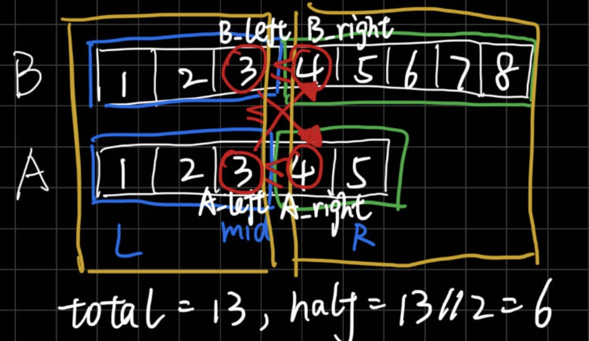

```python
def findMedianSortedArrays(self, nums1: List[int], nums2: List[int]) -> float:
    A, B = nums1, nums2
    total = len(A) + len(B)
    half = total // 2 # 地板除，两个左区间总共有half个元素。
    # 当total为偶数时，2个左区间元素总个数等于2个右区间元素总个数。中位数为[max(2个左区间)+min(2个右区间)]的平均数。
    # 当total为奇数时，2个左区间元素总个数比2个右区间元素总个数少一个。中位数为min(2个右区间)。

    # 为了最低的时间复杂度，只在短的数组上进行二分搜索，把短的数组设置成A
    if len(A) > len(B):
        A, B, = B, A

    l, r = 0, len(A) - 1 # 左右指针，在A上搜
    # 注意：整个二分过程都是在A上搜，B中指针随着A中指针变化而变化
    while True: # 必须用True，改了会错，循环中一定会得到中位数
        mid1 = (l + r) // 2 # A中mid指针，从0~mid总共有mid+1个元素
        mid2 = half - mid1 - 2 # B中要找前[half-(mid+1)]个元素，最后一个元素下标m2 = 要找的元素个数-1 = half - mid1 - 2

        # 防止下标越界，若当前下标小于0，说明当前数组中一个都不取，为了满足不等式(左区间的最大值<=右区间最小值)，要补位-float('inf')。对B数组也类似
        A_left = A[mid1] if mid1 >= 0 else -float('inf')
        # 防止下标越界，若当前下标大于数组长度，说明当前数组中一个都不取，为了满足不等式(左区间的最大值<=右区间最小值)，要补位float('inf')。对B数组也类似
        A_right = A[mid1 + 1] if (mid1 + 1) < len(A) else float('inf')
        B_left = B[mid2] if mid2 >= 0 else -float('inf')
        B_right = B[mid2 + 1] if (mid2 + 1) < len(B) else float('inf')

        # A和B左区间中最大的元素 <= A和B右区间最大的元素，说明划分成功，找到解
        if A_left <= B_right and B_left <= A_right:
            if total % 2 == 1: # 两个数组总长度为奇数
                return min(A_right, B_right)
            else: # 偶数，(A和B左区间的最大值 & A和B右区间的最小值) / 2
                return (max(A_left, B_left) + min(A_right, B_right)) / 2
        # 下面两个判断条件，就是上面if中排除的反例
        if A_left > B_right: # A左区间最大值>B右区间最小值，说明A左区间元素太多
            r = mid1 - 1 # 要缩小A左区间元素
        else: # (B_left > A_right)，B左区间最大值<A右区间最小值，说明B左区间元素太多，相反A左区间元素就太少了
            l = mid1 + 1

```

#### [287. Find the Duplicate Number](https://leetcode.com/problems/find-the-duplicate-number/)（寻找重复数）

> 题意：一个长度为 `n + 1`的数组中，所有数的范围在 `[1, n]`，只有一个数出现 `2`次，其他数都出现 `1`次，要求找到这个重复数。
>
> 思路：最直观的思路是用哈希表，但题意说只能用 `O(1)`空间，因此不行。进而考虑和 `41.缺失的第一个正数`一样，使用原地哈希，把数组当哈希表，但题意说不能改变数组，因此也不行。
>
> 本题的限制条件是 `O(1)`空间且不改变数组 `nums`，因此必须用时间换空间，虽然是很少见的。
>
> 本题给出数的区间是 `[1,n]`，而且是个整数区间，整个区间只有 `1`个重复元素，出现了 `2`次，分析可知：如果一个整数区间里的数据点个数大于这个区间的长度，就说明区间里有重复元素。
>
> 怎么用最短时间确定这个区间？用二分法每次用 `mid`把数组划分为 `2`个区间，观察 `[1,mid]`区间的数是否大于 `mid`个，若大于，说明重复元素在 `[1, mid]`（因为该整数区间长度就是 `mid`，里面元素个数 `>mid` 说明肯定有重复元素），若小于等于，说明重复元素在 `[mid+1, n]`。然后继续对新区间进行划分。
>
> 本题不是对下标进行二分，是对数的范围（区间）进行二分，时间 `O(nlogn)`+空间 `O(1)`

```python
def findDuplicate(self, nums: List[int]) -> int:
    n = len(nums) - 1
    l, r = 1, n
    while l < r: # 因为本题划分为两个区间，所以必须用 l < r
        mid = l + (r - l) // 2 # 把数据划分为两个闭区间左[1,mid],右[mid+1,n]
        cnt = 0
        for num in nums: # 用O(n)时间遍历数组统计落在左区间的数据点个数
            if num <= mid: 
                cnt += 1
        # 如果一个整数区间里的数据点个数大于这个区间的长度，就说明区间里有重复元素
        if cnt > mid: # 严格大于mid
            r = mid # 说明要找的数落在[1,mid]区间
        else:
            l = mid + 1 # 说明要找的数落在[mid+1,n]区间
    return l # return r也行，因为判断条件是l < r，退出循环时，l == r
```

## 堆

#### [215. Kth Largest Element in an Array](https://leetcode.com/problems/kth-largest-element-in-an-array/)（数组中的第K个最大元素）

> 堆模板题
>
> 题意：找到数组中第 `k`大的元素，时间复杂度尽可能低
>
> 思路：用小顶堆来做，堆中元素个数超过 `k`个时，pop掉。最后堆中最小的元素就是结果。时间复杂度 `O(nlogk)`

```python
def findKthLargest(self, nums: List[int], k: int) -> int:
    # 题意：找到数组中第k大的元素，时间复杂度尽可能低
    # 思路：用小顶堆来做，堆中元素个数超过k个时，pop掉。最后堆中最小的元素就是结果。
    import heapq # heapq实现的默认是小顶堆；python没有自带的大顶堆，如果需要用大顶堆，要加负号实现
    heap = []
    for i in range(len(nums)):
        heapq.heappush(heap, nums[i]) # 入堆
        if len(heap) > k:
            heapq.heappop(heap) # 出堆
    return heap[0]
```

#### [347. Top K Frequent Elements](https://leetcode.com/problems/top-k-frequent-elements/)（前K个高频元素）

> 题意：有一个数组，求出现频率第 `k`高的元素
>
> 思路：用小顶堆来做，动态维护 `k`个最大值，要用小顶堆，看到求 `topk`的题，一般都要用堆做
>
> - 用一个大小为 `k`的小顶堆，堆顶是最小值，当堆里元素超过 `k`个时，pop掉堆顶元素，这样，当添加完所有元素时，堆里剩下的是 `k`个最大值。且时间复杂度为 `O(nlogk)`
> - 若直接用快排对 `nums`排序，或用最大堆，需要 `O(nlogn)`的复杂度

```python
def topKFrequent(self, nums: List[int], k: int) -> List[int]:
    import heapq
    hashmap = {}
    heap = [] # heapq实现的默认是小顶堆，python没有自带的大顶堆，需要加负号实现
    res = []
    for i in range(len(nums)): # 在hashmap里记录每个数出现的次数
        if nums[i] in hashmap:
            hashmap[nums[i]] += 1
        else:
            hashmap[nums[i]] = 1
    for num, freq in hashmap.items(): # 遍历hashmap的key和value
        heapq.heappush(heap, (freq, num)) # 根据频率来排序，num无所谓
        if len(heap) > k: # 如果heap中元素超过k个，就弹出
            heapq.heappop(heap)

    for i in range(len(heap)): # 从heap中取出元素
        freq, num = heap[i][0], heap[i][1]
        res.append(num)
    return res # 题意说任意顺序都可以
```

#### [373. Find K Pairs with Smallest Sums](https://leetcode.com/problems/find-k-pairs-with-smallest-sums/)（查找和最小的 K 对数字）

> 需要再看看，逻辑还是不太清晰。
>
> 题意：有两个有序数组 `nums1`和 `nums2`，从 `nums1`和 `nums2`中分别选 `1`个数字构成pair，求 `k`个最小的 `pair sum`
>
> - 不能用双指针，因为两个指针不一定一直在前进，可能会来回跑
>
> 思路：建立小根堆，push规则：`nums1[0]+nums2[0]`肯定是最小的，先push入 `(0,0)`，以后每次弹出堆顶 `(i,j)`时，把该元素放入结果列表中，同时push入 `(i+1,j)`和 `(i,j+1)`。因为 `(i,j)`为当前最小的，下一个最小的要么是在剩下的堆顶，不然就是 `(i+1,j)`或 `(i,j+1)`之一
>
> - 要用visited数组进行去重，否则有的元素可能会被多次访问

```python
def kSmallestPairs(self, nums1: List[int], nums2: List[int], k: int) -> List[List[int]]:
    # 题意：有两个数组nums1和nums2，求k个最小的pair sum
    # 思路：建立小根堆，push规则：先push入(0,0),以后每次弹出堆顶(i,j)时，同时放入(i+1,j)和(i,j+1)。因为(i,j)为当前最小的，下一个最小的要么是在剩下的堆顶，不然就是(i+1,j)或(i,j+1)之一
    # 不能用双指针，因为两个指针不一定一直在前进，可能会来回跑
    import heapq
    heap = [] # 最小堆
    res = []
    # 入堆时要把两个索引也同时加入，所以堆里存放的是三元组
    heap.append((nums1[0] + nums2[0], 0, 0)) 
    count = 0 # 记录已经获取到几个最小值
    visited = set() # 用于索引去重
    visited.add((0, 0))
    while count < k:
        num, i, j = heapq.heappop(heap) # 获得当前堆顶的最小值
        res.append([nums1[i], nums2[j]]) # 要把两个数都加入结果数组
        count += 1 # 累加count
        # 下一个最小的只可能是(i+1, j)或(i, j+1)，如果两个元素都没用过，就都入堆
        if i+1 < len(nums1) and (i+1, j) not in visited: 
            # 检查i+1是否越界，(i+1, j)是否用过
            next_val = nums1[i+1] + nums2[j]
            heapq.heappush(heap, (next_val, i+1, j))
            visited.add((i+1, j))
        if j+1 < len(nums2) and (i, j+1) not in visited:
            # 检查j+1是否越界，(i, j+1)是否用过
            next_val = nums1[i] + nums2[j+1]
            heapq.heappush(heap, (next_val, i, j+1))
            visited.add((i, j+1))
    return res
```

#### [502. IPO](https://leetcode.com/problems/ipo/)

> 题意：给一串纯利润，一串本金。我们最多能选k个项目，有w的启动资金。为了使总利润最大，问怎么选？
>
> 思路：将输入组合起来并按本金排序，这样在循环中，所有小于等于当前本金的都可以加入到大顶堆中(维护所有可选的利益的堆)，于是我们就可以选到当前利益最大的那个的了。
>
> - 需要一次快排按本金排序。然后在每次循环中，把可选项目加入大顶堆，按利润排序，每次循环选一个项目
> - 特殊情况：如果当前的资本已经不支持任何项目了，也就是拥有的钱再也不可能发生变化了，只能结束了。

```python
def findMaximizedCapital(self, k: int, w: int, profits: List[int], capital: List[int]) -> int:
    # 先把纯利润和本金组合起来，按本金从小到大排序。
    # 当需要对两个list同时排序的时候，可以zip后再排序
    projects = sorted(zip(profits, capital), key = lambda x: x[1])
    count = 0
    i = 0
    import heapq
    heap = []
    while count != k: # 一次循环，选一个项目
        while i < len(projects) and projects[i][1] <= w: # 把当前可以买的项目(本金<=w)全加入大顶堆，判断哪个利润最大。记得要判断i，否则会越界
        # i在下一次循环中不会从0开始，因为自身本金是叠加的，这一轮能选的项目已经入堆了，下一轮可以直接选，因此i直接从上一轮本金选不了的项目开始
            heapq.heappush(heap, -projects[i][0]) # 把纯利润加入大顶堆
            i += 1 # 看下一个项目
        if heap: # 题意是说最多选k个项目，有可能因为本金限制选不到k个
            max_profit = heapq.heappop(heap) # 获取堆顶最大利润
            max_profit = -max_profit # 由于存入的时候是-，所以取出要加-
            w += max_profit # 本金是可以累加的
            count += 1
        else: # 当一个都选不了的时候，直接break
            break
    return w
```

#### [295. Find Median from Data Stream](https://leetcode.com/problems/find-median-from-data-stream/)（数据流的中位数）

> 题意：有一个数组，会不停插入元素，要实时获取这个数组中位数
>
> 思路：由于数组会进行大量的加入元素的操作(`5 * 10^4`次)，为了使用较短时间，使数组一直保持有序，需要使用堆（每次都用快排时间复杂度会很高）。
>
> 因为要获取中位数(可能是1个或2个)，我们需要用一个大顶堆+一个小顶堆，分别存数组的一半。**大顶堆**存**小**的元素，**小顶堆**存**大**的元素。这样，`大顶堆` 和 `小顶堆` 的 `堆顶`才最靠近 `中位数`。
>
> - 我们规定：当数组个数为奇数时，大顶堆比小顶堆的元素个数多1。

```python
class MedianFinder:
    import heapq
    def __init__(self):
        self.max_heap = []
        self.min_heap = []

    def addNum(self, num: int) -> None:
        # 两个堆数量相等时，根据规定，为了维护加入后，大顶堆元素多1个，因此要加入大顶堆。
        # 但不能直接把num加入大顶堆。而是把更靠近中点的那个元素加入大顶堆，如何知道哪个元素更靠近中位数呢？
        # 此时，不确定 num 还是 当前小顶堆 的堆顶更接近中位数
        # 因此要先把num加入小顶堆，再弹出 小顶堆 的堆顶（此时这个堆顶更接近中位数）
        # 然后把这个元素加入到大顶堆中
        if len(self.max_heap) == len(self.min_heap): 
            heapq.heappush(self.min_heap, num)
            med = heapq.heappop(self.min_heap)
            heapq.heappush(self.max_heap, -med)
        else: # 两个堆数量不相等时，一定是小顶堆元素少1个，因此要把更靠近中点的那个元素加入小顶堆。
	# 小顶堆的操作和大顶堆同理，也是先加入大顶堆，然后把大顶堆的堆顶加入到小顶堆。
            heapq.heappush(self.max_heap, -num)
            med = -heapq.heappop(self.max_heap)
            heapq.heappush(self.min_heap, med)

    def findMedian(self) -> float:
        # 因为大顶堆存小的元素，小顶堆存大的元素。所以，大顶堆 和 小顶堆 的堆顶最接近中位数。
        if len(self.max_heap) == len(self.min_heap): # 中位数有2个
            return (-self.max_heap[0] + self.min_heap[0]) / 2 
        else: # 中位数只有1个，因为大顶堆元素多1个，在大顶堆的堆顶
            return -self.max_heap[0]

# Your MedianFinder object will be instantiated and called as such:
# obj = MedianFinder()
# obj.addNum(num)
# param_2 = obj.findMedian()
```

## 位运算

#### [136. Single Number](https://leetcode.com/problems/single-number/)（只出现一次的数字）

> 题意：一个数组，所有元素都出现过 `2`次，只有一个元素出现了 `1`次，求这一个元素，题目要求时间复杂度 `O(N)`，空间复杂度 `O(1)`，因此排除暴力和哈希法。
>
> 思路：用异或(`xor`)来做，两个相同的元素异或为 `0`，一个元素和 `0`异或结果是元素本身。同时，异或运算满足交换律和结合律，即运算结果与 `nums`的元素顺序无关。因此，只要把数组中所有元素异或起来，相同元素抵消为 `0`，剩下的元素就是出现过一次的元素。

```python
def singleNumber(self, nums: List[int]) -> int:
    res = 0
    for i in range(len(nums)):
        res = res ^ nums[i]
    return res
```

#### [137. Single Number II](https://leetcode.com/problems/single-number-ii/)（只出现一次的数字2）

> 题意：136的进阶版，136是其余元素都出现2次，本题是其余元素都出现3次，只有一个元素出现1次，要我们找出这个元素。要求O(n)时间和O(1)空间。
>
> 思路：因为其他元素都是3次一起出现，所以所有数某一位总和为3的倍数，说明要找的数在该位为0；总和为3的倍数+1,说明要找的数在该位为1。由于要常数空间，不能新增数组。
>
> 题意说：数组元素是32位(0~31)。
>
> 注意：计算机采用补码方式存储，当最高位为1时，表示负数。而python中最高位为1时，不会像c++那种会自动识别成负数，需要人为处理。但这一步现在还没有搞懂怎么做的。

```python
def singleNumber(self, nums: List[int]) -> int:
    res = 0
    for i in range(32): # 低->高：0~31，一共32位
        cur_bit_sum = 0 # 用于累加 该位上的数值
        for num in nums:
            cur_bit = (num >> i) & 1 # num的第i位（从低位开始）
            cur_bit_sum += cur_bit # 累加当前位
        x = cur_bit_sum % 3 # 要求的数的第i位（从低位开始）
        res += (x << i) # 左移后加到结果中
        if i == 31: # 最高位是1，表示负数，但python不会自动转换，需要手动算负数
            return res if x == 0 else ~(res ^ 0xffffffff)
    return res
```

#### [201. Bitwise AND of Numbers Range](https://leetcode.com/problems/bitwise-and-of-numbers-range/)（数字范围按位与）

> 题意：求区间 `[left, right]` 内所有整数按位与运算的结果。
>
> 思路：从低位开始判断，图中绿框，若m!=n，说明最末位肯定有0也有1，与运算后结果为0。然后不看末位，看图中蓝框，若m!=n，说明最末位还是有0也有1，与运算后结果为0。最后看图中红框，m==n，与运算结果就是红框中的值。
>
> - 相当于结果只保留了红框中的值，后面几位不同部分的与运算结果就是0，也就是相当于红框中的值左移2位。
>
> 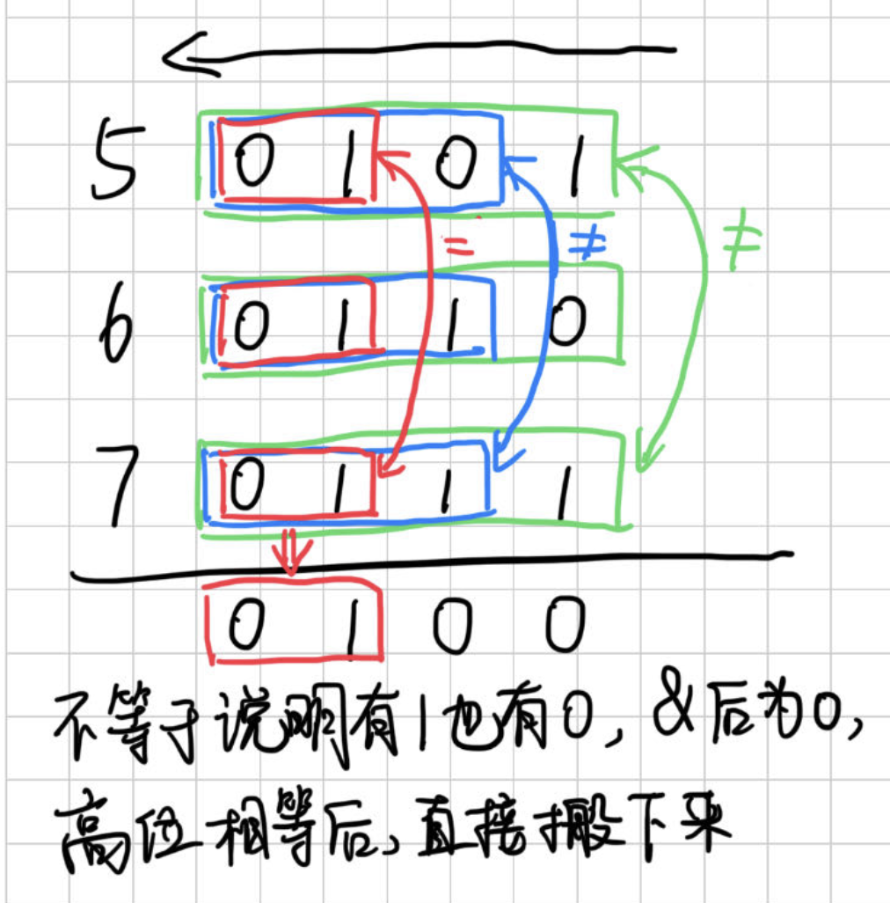

```python
def rangeBitwiseAnd(self, left: int, right: int) -> int:
    while right != left: # 说明末位肯定有0也有1，与运算结果为0
        i += 1 # 低位0的个数+1
        right = right >> 1 # 右移排除末位
        left = left >> 1 # 右移排除末位
    return right << i # 右边补i个0
```

## 数学

#### [172. Factorial Trailing Zeroes](https://leetcode.com/problems/factorial-trailing-zeroes/)（阶乘后的零）

> 题意：给定一个数，求出一个数的阶乘末尾有多少个 0。
>
> 思路：`10`的因子最小就是 `2`和 `5`，其实就是求因子中有几个 `(2,5)`的pair，一个pair组成一个10。由于2的数量远大于5的数量，因此只要找因子中有几个 `5`。因子中5的数量，就是答案。
>
> 规律是每隔 `5` 个数，出现一个 `5`，每隔 `25` 个数，出现 `2` 个 `5`，每隔 `125` 个数，出现 `3` 个 `5`... 以此类推。
>
> 最终 `5` 的个数就是 `n // 5 + n // 25 + n // 125 ...`
>
> 具体来说怎么算？我们会用一个循环，判断当时n是否大于0。在第一次循环中，我们先算 `n // 5`。 第二次循环算 `n // 25` 的时候，先把 `n` 更新，`n = n // 5`，然后再计算 `n // 5` 即可， 这样就达到了算 `n // 25`的效果。后边的同理。
>
> 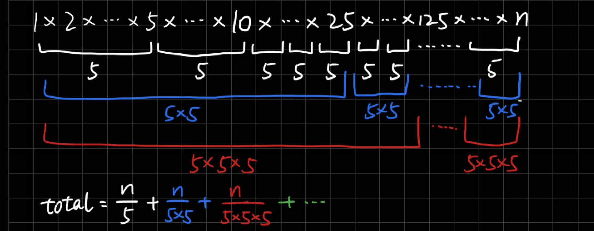
>
> - 也可以这样理解，`n`是一个长度，每隔 `5`米能拿到 `1`个奖励，每隔 `25`米能拿到 `2`个奖励，每隔 `125`米能拿到 `3`个奖励。但重合的时候只能拿最多的那个奖励。
>
> 这样以来，我们就可以先算能拿几个距离5米的奖励 `n // 5`。这时，每隔 `5`米的奖励都领完了，每隔 `25`米也只剩 `1`个奖励了。我们就把总长度压缩为原来的 `1 / 5`。这样又回到了每隔 `5`米有 `1`个奖励。我们就可以用一种 `while`循环的方式计算，直到总长度被压缩到 `0`，说明奖励都领完了。

```python
def trailingZeroes(self, n: int) -> int:
    cnt = 0
    while n > 0:
        cnt += n // 5
        n //= 5
    return cnt
```

#### [69. Sqrt(x)](https://leetcode.com/problems/sqrtx/)（x的平方根）

> 题意：求 `x`的算数平方根
>
> 思路：用二分法搜这个算术平方根，初始左边界是 `1`，右边界是 `x`

```python
def mySqrt(self, x: int) -> int:
    l, r = 1, x
    while l <= r:
        mid = l + (r - l) // 2
        if mid * mid == x: # 找到解
            return mid
        elif mid * mid < x:
            l = mid + 1
        else:
            r = mid - 1
    return r # 除不尽的情况下，算术平方根是小一点的整数
```

#### [50. Pow(x, n)](https://leetcode.com/problems/powx-n/)（快速幂）

> 题意：求x的n次快速幂，正常求幂是O(n)时间，快速幂是O(logn)时间
>
> 思路：总体思路是把指数转换为二进制，不断累乘底数。
>
> - 举例:`3^13 = 3^1101 = (3^8) * (3^4) * (1) * (3^1)`
> - 因此把 `n=13`先转换为二进制 `1101`，然后从右边往左遍历，每次都累乘底数 `x = x * x`。使用 `res`保存当前累乘结果，初始化为 `1`。
>   - 当遍历到的位为 `1`时，把 `x`乘到 `res`上，对应上述公式中的 `(3^8, 3^4, 3^1)`，
>   - 当遍历到的位为 `0`时，不需要进行操作
> - 针对于指数 `n = 13 = 1101`，对于末位的底数为 `x`，对于倒二位的底数为 `x^2`，对于倒三位的底数为 `x^4`，对于最高位的底数为 `x^8`。这样我们就能以迭代的方式，每次累乘底数 `x = x * x`，然后当当前指数位为 `1`时，把底数 `x`乘到结果 `res`上。
>
> 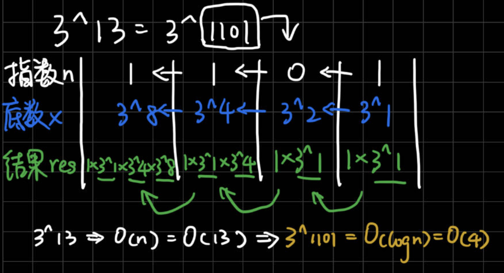

```python
def myPow(self, x: float, n: int) -> float:
    res = 1 # 当前结果
    if n < 0: # 指数为负数的情况，要单独处理，只要把底数取倒数，指数改为正数就行
        x, n = 1 / x, -n 
    while n > 0: # 不断看指数末位是否为1，并右移
        if n % 2 == 1: # 指数末位为1（和n & 1 == 1相同）
            res = res * x
        x = x * x # 累乘当前底数
        n //= 2 # 指数右移1位（和n >>= 1相同）
    return res
  
```

#### [149. Max Points on a Line](https://leetcode.com/problems/max-points-on-a-line/)（直线上最多的点数）

> 题意：给一堆点 `[xi, yi]`，判断最多有多少个点在同一条直线上。
>
> 思路：两两之差用乘法判断在不在一条直线上。(但是需要 `O(n^3)`暴力判断)
>
> - 改进方法是，外层循环遍历点 `i`，内层循环遍历另一个点 `j`。对于同一个 `i`，只要不同的 `j`与这个 `i`的斜率相同，就说明 `i`和 `j`在同一条直线上（而无需判断截距）。用一个hashmap记录不同斜率的pair数。`O(n^2)`时间+`O(n)`空间
>
> 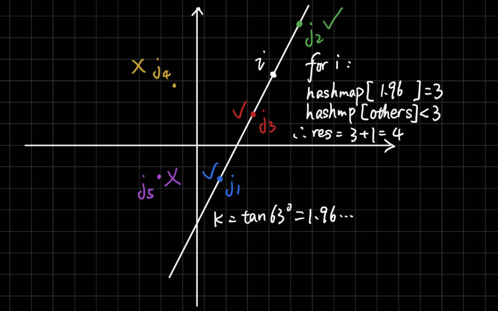

```python
def maxPoints(self, points: List[List[int]]) -> int:
    res = 0
    for i in range(len(points)): # 确定一个点为i
        hashmap = {} # 对每个新的点i要有一个新的字典，记录其他点j和他的斜率
        max_val = 0 # 在同一条直线上的pair，注意：这里是以i位起点的pair
        for j in range(len(points)): 
        # 已经固定第一个点为i的情况下，只要看不同的点j和i的斜率是否一样就可以判断在不在一条直线上，无需判断截距，我们用一个hashmap记录斜率
            if j == i: # 确保两个点不相同
                continue
            x1, y1 = points[i]
            x2, y2 = points[j]
            dy, dx = y1 - y2, x1 - x2
            key = dy / dx if dx != 0 else float('inf')
            if key not in hashmap: # 斜率相同就证明这对pair在同一条直线上
                hashmap[key] = 0
            hashmap[key] += 1
            max_val = max(max_val, hashmap[key])
        res = max(res, max_val + 1) # 由于max_val记录的是pair数，因此最后还得加上自身节点
    return res
```

## 分治

#### [148. Sort List](https://leetcode.com/problems/sort-list/)（排序链表）

> 题意：对链表进行排序，`O(nlogn)`时间，进阶：`O(1)`空间
>
> 思路：对链表进行排序要用归并排序，满足时间要求。归并有两种写法：递归 or 自底向上。递归能实现 `O(nlogn)`时间，但无法实现 `O(1)`空间。因为递归更简单，因此只实现递归写法。
>
> - 这种写法相当于后序遍历，只有到空节点或叶子节点才能得到有序链表，然后父节点再把两个有序链表合成一个有序链表，然后一层层向上传递，向上传递的同时进行合并。最后得到一个有序链表。
> - 在 `sortFunc`函数里，不断往下递归，直到叶子节点才能得到有序链表（单个节点或者 `None`），然后向上传递的过程中，不断地把两个有序链表合并成一个。最终到根结点时，才得到一整个有序链表。
>
> [ Krahets思路](https://leetcode.cn/problems/sort-list/solutions/13728/sort-list-gui-bing-pai-xu-lian-biao-by-jyd)

```python
def sortList(self, head: ListNode) -> ListNode:
    def sortFunc(head): # 对一个链表排序，等于对其前后部分分别排序，然后串联起来
        if not head or not head.next: # 终止条件：当没有节点or只有一个节点时
            return head # 直接返回
        dummy = ListNode(next=head) # 快慢指针后，为了让slow在中点or中点前一位，和后半部分链表断开，fast和slow要从dummy开始
        slow = fast = dummy # 快慢指针
        while fast and fast.next:
            slow, fast = slow.next, fast.next.next
        mid, slow.next = slow.next, None # mid是中点或中点后一位，并断开前后链表
        left = sortFunc(head) # 排序前半部分
        right = sortFunc(mid) # 排序后半部分
        return merge(left, right) # 对一个链表排序，等价于对链表前后两部分分别排序，然后再串联起来
  
    def merge(head1, head2): # 合并两个有序链表为一个有序链表
        dummy = ListNode() # 用一个dummy节点
        tmp, i, j = dummy, head1, head2 
        # 遍历两个链表，对比i和j哪个小，一个个串起来
        while i and j: # 注意：是and
            if i.val < j.val:
                tmp.next, i = i, i.next
            else:
                tmp.next, j = j, j.next
            tmp = tmp.next # 注意：有三个指针需要更新
        if i: # 如果某个链表还有剩余节点，就串起来
            tmp.next = i
        elif j:
            tmp.next = j
        return dummy.next
  
    return sortFunc(head)
```

#### [23. Merge k Sorted Lists](https://leetcode.com/problems/merge-k-sorted-lists/)（合并K个升序链表）

> 前置题：[148. Sort List](https://leetcode.com/problems/sort-list/)（排序链表）
>
> 题意：有 `k`个有序链表，需要我们合成一个有序链表。
>
> 思路：链表的排序，可以想到归并排序。特别是多个有序链表合并为一个有序链表。
>
> - 如果先合并前两个链表，再把得到的新链表和第三个链表合并，再和第四个链表合并...这样时间复杂度会比较高，这里不予证明。
> - 应该把 `lists`一分为二（尽量均分），先合并前一半的链表，再合并后一半的链表，然后把这两个链表合并成最终的链表。如何合并前一半的链表呢？我们可以继续一分为二。如此分下去直到只有一个链表或没有，此时无需合并。
> - 这种写法和 `148.排序链表`一样，是一种后序遍历。在 `sortFunc`函数里，不断往下递归，直到叶子节点才能得到有序链表（单个链表或者 `None`），然后向上传递的过程中，不断地把两个有序链表合并成一个。最终到根结点时，才得到一整个有序链表。
>
> 时间复杂度：`O(nlog⁡k)`，其中 `k`为 `lists`的长度，`n`为所有链表的节点数之和。每个节点参与链表合并的次数为 `O(log⁡k)`次，一共有 `n`个节点，所以总的时间复杂度为 `O(nlog⁡k)`。
> 空间复杂度：`O(log⁡k)`。递归深度为 `O(log⁡k)`，需要用到 `O(log⁡k)`的栈空间。Python忽略切片产生的额外空间。
>
> [灵茶山艾府的思路](https://leetcode.cn/problems/merge-k-sorted-lists/solutions/2384305/liang-chong-fang-fa-zui-xiao-dui-fen-zhi-zbzx)

```python
def mergeKLists(self, lists: List[Optional[ListNode]]) -> Optional[ListNode]:

    def sortFunc(lists): 
        m = len(lists) # 链表的个数
        if m == 0: # 注意输入的 lists 可能是空的
            return None
        elif m == 1: # 只有一个链表时，无需合并，直接返回
            return lists[0]
        left = sortFunc(lists[:m // 2]) # 合并左半部分，返回一个有序链表
        right = sortFunc(lists[m // 2:]) # 合并右半部分，返回一个有序链表
        return merge2Lists(left, right) # 最后把左半和右半合并为一个有序链表

    def merge2Lists(head1, head2): # 合并两个有序链表
        dummy = ListNode()
        tmp, i, j = dummy, head1, head2
        while i and j: # 遍历两个链表
            if i.val < j.val: # 当前哪一个节点值更小，就拼起来
                tmp.next, i = i, i.next
            else:
                tmp.next, j = j, j.next
            tmp = tmp.next
        if i: # 把剩余的部分串起来
            tmp.next = i
        elif j:
            tmp.next = j
        return dummy.next
  
    return sortFunc(lists)
```

> 也可以用堆排序来做，代码直接复制的，这里不予深究。
>
> - 时间复杂度：`O(nlog⁡k)`，其中 `k`为 `lists` 的长度，`n`为所有链表的节点数之和。
> - 空间复杂度：`O(k)`。堆中至多有 `k`个元素。

```python
ListNode.__lt__ = lambda a, b: a.val < b.val  # 让堆可以比较节点大小

class Solution:
    def mergeKLists(self, lists: List[Optional[ListNode]]) -> Optional[ListNode]:
        cur = dummy = ListNode()  # 哨兵节点，作为合并后链表头节点的前一个节点
        h = [head for head in lists if head]  # 初始把所有链表的头节点入堆
        heapify(h)  # 堆化
        while h:  # 循环直到堆为空
            node = heappop(h)  # 剩余节点中的最小节点
            if node.next:  # 下一个节点不为空
                heappush(h, node.next)  # 下一个节点有可能是最小节点，入堆
            cur.next = node  # 合并到新链表中
            cur = cur.next  # 准备合并下一个节点
        return dummy.next  # 哨兵节点的下一个节点就是新链表的头节点
```

#### [427. Construct Quad Tree](https://leetcode.com/problems/construct-quad-tree/)（构建四叉树）

> 题意：给一个正方形 `grid`，四边相等，若其中所有方格值都相等，则这个正方形可以视为一个叶子节点；否则，要将正方形四等分，这四个小正方形视为当前正方形的四个孩子节点。然后递归下去，直到找到叶子节点。直到构建完一个四叉树。
>
> 思路：构建四叉树，因此用递归，如果区域内所有值都相等（用暴力判断即可，题意说正方形边长最多是 `64`，用前缀和优化作用不大），则构建叶子节点，否则将区域四等分，dfs构造节点。

```python
def construct(self, grid: List[List[int]]) -> 'Node':
    def dfs(r0, r1, c0, c1):
        for i in range(r0, r1):
            for j in range(c0, c1):
                if grid[i][j] != grid[r0][c0]: # (r0, r1, c0, c1)内只要有一个值不相等，就要把当前正方形分成四份，因此当前正方形不是叶子节点。
                    topLeft = dfs(r0, (r0+r1)//2, c0, (c0+c1)//2)
                    topRight = dfs(r0, (r0+r1)//2, (c0+c1)//2, c1)
                    bottomLeft = dfs((r0+r1)//2, r1, c0, (c0+c1)//2)
                    bottomRight = dfs((r0+r1)//2, r1, (c0+c1)//2, c1)
                    return Node(True, False, topLeft, topRight, bottomLeft, bottomRight)
        # (r0, r1, c0, c1)内所有值都相等，当前正方形视为一个整体（叶子节点）
        # if all(grid[i][j] == grid[r0][c0] for i in range(r0,r1) for j in range(c0,c1)): # 也可以用all判断方形区域内是否所有值都相等
        return Node(grid[r0][c0] == 1, True, None, None, None, None)
  
    m = len(grid) # 长宽一样，而且本题规定正方形边长为n=2^x，因此可以无限四等分，直到边长为1
    return dfs(0, m, 0, m)
  
```

## 动态规划

### 单维动态规划

#### 总结

> - 单维DP中：最长递增子串&子序列，最大子串和
> - dp数组定义：
>
>   - 子串 and 子序列问题的 `dp[i][j]`定义: 以 `nums[i-1]`结尾的子串 or 子序列...

#### [674. Longest Continuous Increasing Subsequence](https://leetcode.com/problems/longest-continuous-increasing-subsequence/)（最长连续递增子序列）

> 题意：给一个序列，求最长连续递增子序列（**最长递增子串，连续**）
>
> 思路：一维DP，一层循环。`dp[i]`：以 `nums[i]`结尾的最长连续递增的子序列长度。

```python
def findLengthOfLCIS(self, nums: List[int]) -> int:
    # 本题是最长连续递增子序列，300是最长递增子序列，是这题的进阶版
    # `dp[i]`：以 `nums[i]`结尾的最长连续递增的子序列长度
    dp = [1 for i in range(len(nums))]
    for i in range(1, len(nums)):
        if nums[i] > nums[i-1]:
            dp[i] = dp[i-1] + 1
        else:
            dp[i] = 1 # 可以忽略 因为初始化过了
    res = max(dp)
    return res  
```

#### [300. Longest Increasing Subsequence](https://leetcode.com/problems/longest-increasing-subsequence/)（最长递增子序列）

> 题意：给一个序列，求**最长递增子序列**（**非连续**）
>
> 思路：一维DP，两层循环。`dp[i]`：以 `nums[i]`结尾的递增子序列的最大长度

```python
def lengthOfLIS(self, nums: List[int]) -> int:
    # `dp[i]`：以 `nums[i]`结尾的递增子序列的最大长度
    # 注意所有位置初始化为1（自身就是一个递增子序列），初始化为0会导致状态转移出错
    dp = [1 for i in range(len(nums))]
    for i in range(1, len(nums)):
        for j in range(0, i):
            if nums[i] > nums[j]:
                dp[i] = max(dp[i], dp[j] + 1)
            else:
                dp[i] = dp[i] # 可以忽略
    res = max(dp)
    return res
```

#### [53. Maximum Subarray](https://leetcode.com/problems/maximum-subarray/)（最大子序和）

> 题意：给一个序列，求最大子序和（**最大的子串和，连续**）
>
> 思路：`dp[i]`: 以 `nums[i]`结尾的子串的最大和

```python
def maxSubArray(self, nums: List[int]) -> int:
    # dp[i]: 以nums[i]结尾的子数组的最大和
    # 简单dp题，subarray是连续的，所以dp[i]可以从dp[i-1]状态转移
    # dp[i-1] > 0时，说明上一位已经累积了正的和，所以dp[i]要从dp[i-1]进行累加
    # dp[i-1] < 0时，说明上一位累积的和为负，所以dp[i]重新开始，为nums[i]
    dp = [0 for i in range(len(nums))]
    dp[0], max_sum = nums[0], nums[0]
    for i in range(1, len(nums)):
        if dp[i-1] > 0: 
            dp[i] = dp[i-1] + nums[i]
        else:
            dp[i] = nums[i]
        max_sum = max(max_sum, dp[i])
    return max_sum 
```

#### [152. Maximum Product Subarray](https://leetcode.com/problems/maximum-product-subarray/)（乘积最大子数组）

> 题意：给一个数组，求有最大乘积的子数组（子串，连续）
>
> 思路：需要考虑正负性，因为当前的最大值，可能是从上一刻最大值 or 上一刻最小值（负）转移得到，因此需要两个dp数组，一个保存最大乘积，另一个保存最小乘积。
>
> - `max_dp[i]`:以 `nums[i]`结尾的最大乘积子串
> - `min_dp[i]`:以 `nums[i]`结尾的最小乘积子串

```python
def maxProduct(self, nums: List[int]) -> int:
    m = len(nums)
    max_dp, min_dp = [1 for i in range(m)], [1 for i in range(m)]
    max_dp[0], min_dp[0], res = nums[0], nums[0], nums[0]
    for i in range(1, m):
        max_dp[i] = max(nums[i], max_dp[i-1] * nums[i], min_dp[i-1] * nums[i])
        min_dp[i] = min(nums[i], max_dp[i-1] * nums[i], min_dp[i-1] * nums[i])
        res = max(res, max_dp[i])
    return res
```

### 多维动态规划

#### - 总结

> - 多维DP中：最长公共子串&子序列，编辑距离系列，最长回文子序列。回文子串不用DP，用双指针中心扩展
> - dp数组定义：
>
>   - 子串问题的 `dp[i][j]`定义: 以 `nums1[i-1]`结尾的 `nums1`子串 和 以 `nums2[j-1]`结尾的 `nums2`子串...
>   - 子序列问题的 `dp[i][j]`定义:  `nums1[0, i-1]` 部分 和 `nums2[0, j-1]` 部分 ...
> - 这一类问题，在递推过程中，基本是要分析两种情况：
>
>   - `s[i - 1]` 与 `t[j - 1]`相等
>   - `s[i - 1]` 与 `t[j - 1]`不相等

#### [118. Pascal Triangle](https://leetcode.com/problems/pascals-triangle/)（杨辉三角）

> 题意：杨辉三角赋值
>
> 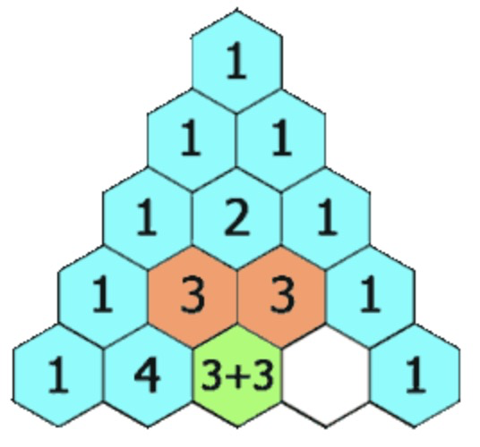
>
> 思路：最简单的二维dp，可以先把两边赋值 `1`，再处理中间元素

```python
def generate(self, numRows: int) -> List[List[int]]:
    dp = [[1]]
    for i in range(1, numRows):
        dp.append([1] * (i+1))
        dp[i][0], dp[i][-1] = 1, 1
        for j in range(1, i):
            dp[i][j] = dp[i-1][j-1] + dp[i-1][j]
    return dp
```

#### [120. Triangle](https://leetcode.com/problems/triangle/)（三角形）

> 题意：给一个三角形，找出自顶向下的最小路径和。如果在当前行的下标 `j`，到下一行只能到下标 `j`和 `j+1`。
>
> 思路：用二维dp，自底向上做状态转移，能避免很多边界条件的处理。
>
> `dp[i][j]`为从底部到 `(i,j)`为止的最小路径和，状态转移方程非常直观
>
> ```python
> # 这样看坐标更直观
> [
> [2],
> [3,4],
> [6,5,7],
> [4,1,8,3]
> ]
> # The minimum path sum from top to bottom is 2 + 3 + 5 + 1 = 11 (underlined above).
> ```

```python
def minimumTotal(self, triangle: List[List[int]]) -> int:
    n = len(triangle) # 由题意：三角形的底边长等于高度
    dp = [[0 for j in range(n)] for i in range(n)] # 会被覆盖，所以随便初始化

    for j in range(n): # 初始化底边dp数组
        dp[-1][j] = triangle[-1][j]

    for i in range(n-2, -1, -1):
        for j in range(len(triangle[i])):
            dp[i][j] = min(dp[i+1][j], dp[i+1][j+1]) + triangle[i][j]
  
    return dp[0][0]
```

#### [221. Maximal Square](https://leetcode.com/problems/maximal-square/)（最大正方形）

> 题意：一个二维数组，有 `0`和 `1`，求只包含 `1`的最大正方形面积
>
> 思路：`dp[i][j]`为以 `(i,j)`为右下角的正方形的最大**边长**(是边长不是面积)。
>
> 要知道最大边长受限于谁：`(i,j)`坐标为右下角所能形成的最大正方形的边长，取决于它左边、上方、斜上方的项所能形成的最大正方形的**边长**，为三者的 `min` + 自身长度 `1`

```python
def maximalSquare(self, matrix: List[List[str]]) -> int:
    m, n = len(matrix), len(matrix[0])
    max_side = 0
    dp = [[0 for j in range(n)] for i in range(m)]
    for i in range(m): # 初始化第一列
        if matrix[i][0] == '1':
            dp[i][0] = 1
            max_side = 1
    for j in range(n): # 初始化第一行
        if matrix[0][j] == '1':
            dp[0][j] = 1 
            max_side = 1
    for i in range(1, m):
        for j in range(1, n):
            if matrix[i][j] == '1':
                dp[i][j] = min(dp[i-1][j], dp[i][j-1], dp[i-1][j-1]) + 1
                max_side = max(max_side, dp[i][j])
    return max_side ** 2
```

#### [97. Interleaving String](https://leetcode.com/problems/interleaving-string/)（交错字符串）

> 题意：能否用两个字符串 `s1,s2`的子串按顺序拼成 `s3`
>
> 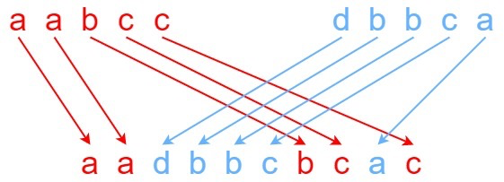
>
> 思路：`dp[i][j]` 代表 `s1[0~i-1]` 与 `s2[0~j-1]` 能否拼接成 `s3[0~i+j-1]`
>
> 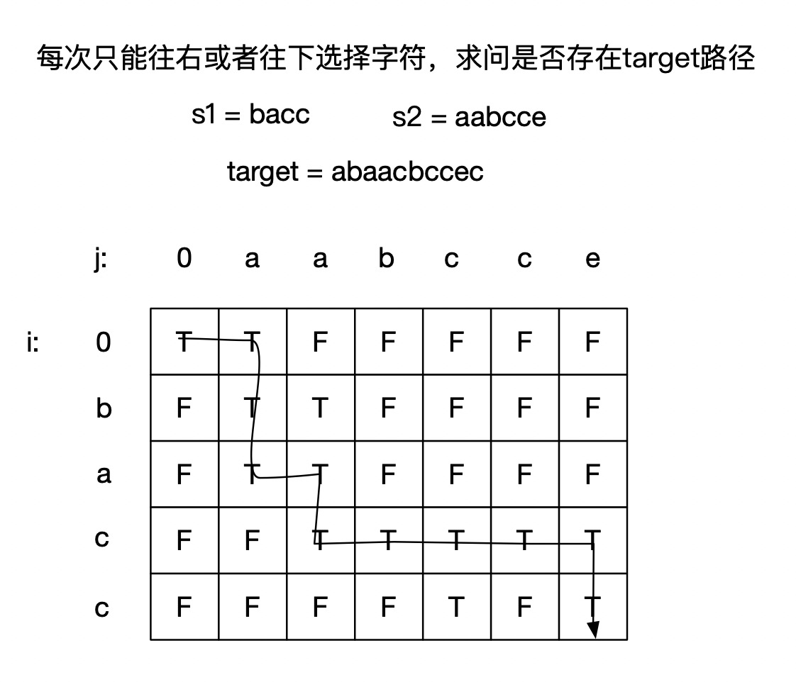

```python
def isInterleave(self, s1: str, s2: str, s3: str) -> bool:
    # 题意：能否用两个字符串s1,s2的子串按顺序拼成s3
    # 思路：二维dp数组
    m, n, l = len(s1), len(s2), len(s3)
    if m + n != l: # 单独判断：如果长度不符，直接返回False
        return False
    # 两个数组或者字符串的dp题目(要从前1位推到后1位),都在dp数组开头补1位,便于初始化
    # 所以字符串的下标 `(i-1, j-1)`比dp数组的下标 `(i, j)`少1
    # dp[i][j]: s1[0~i-1] 与 s2[0~j-1] 能否拼接成 s3[0~i+j-1]
    dp = [[False for j in range(n+1)] for i in range(m+1)]
    dp[0][0] = True # 初始化左上角元素
    for i in range(1, m+1): # 初始化第一列，仅用s1[0~i-1]能否构成s3[0~i-1]
        if s1[i-1] == s3[i-1]: # 相等，说明可以构成
            dp[i][0] = True
        else: # 不相等，说明后面都无法构成
            break
    for j in range(1, n+1): # 初始化第一行，仅用s2[0~j-1]能否构成s3[0~j-1]
        if s2[j-1] == s3[j-1]: # 相等，说明可以构成
            dp[0][j] = True
        else: # 不相等，说明后面都无法构成
            break
    for i in range(1, m+1): # 递推
        for j in range(1, n+1):
            if s1[i-1] == s3[i+j-1] and dp[i-1][j]: # 从dp[i-1][j]转移
            # s1中前i个字符+s2中前j个字符，s3中就是i+j个字符，因此下标为i+j-1
                dp[i][j] = True 
            elif s2[j-1] == s3[i+j-1] and dp[i][j-1]: # 从dp[i][j-1]转移
            # s1[0~i-1]一共i个字符，s2[0~j-1]一共j个字符，s3中就是i+j个字符，因此下标为i+j-1
                dp[i][j] = True
            else:
                dp[i][j] = False
    return dp[-1][-1]
```

#### [718. Maximum Length of Repeated Subarray](https://leetcode.com/problems/maximum-length-of-repeated-subarray/)（最长重复子数组）

> 题意：求两个数组的最长重复子数组长度（也就是最长公共子串，必须是连续的）
>
> 思路：`dp[i][j]`:以 `i-1`结尾的 `nums1`，和以 `j-1`为结尾的 `nums2`，最长重复子数组长度。
>
> - 两个数组或者字符串的dp题目(要从前1位推到后1位),都在dp数组开头补1位,便于初始化
> - 所以字符串的下标 `(i-1, j-1)`比dp数组的下标 `(i, j)`少1

```python
def findLength(self, nums1: List[int], nums2: List[int]) -> int:
    res = 0
    m, n = len(nums1), len(nums2)
    # 两个数组或者字符串的dp题目(要从前1位推到后1位),都在dp数组开头补1位,便于初始化
    # 所以字符串的下标 `(i-1, j-1)`比dp数组的下标 `(i, j)`少1
    # dp[i][j]: 以i-1结尾的nums1，和以j-1为结尾的nums2，最长重复子数组长度。
    dp = [[0 for j in range(n+1)] for i in range(m+1)]
    # 第一行和第一列为0，不用初始化了
    for i in range(1, m+1): # 递推
        for j in range(1, n+1):
            if nums1[i-1] == nums2[j-1]: # 匹配，串的下标和dp的下标差一位
                dp[i][j] = dp[i-1][j-1] + 1
                res = max(res, dp[i][j])
            else:  # 不匹配，可以忽略，因为初始化过了
                dp[i][j] = 0
    return res
```

#### [1143. Longest Common Subsequence](https://leetcode.com/problems/longest-common-subsequence/)（最长公共子序列）

> 题意：求两个序列的最长公共子序列长度（非连续）
>
> 思路：`dp[i][j]`: `text1[0~i-1]`部分和 `text2[0~j-1]`部分的最长公共子序列长度，和前几题以 `i-1,j-1`结尾的子串/子序列定义不同
>
> - 两个数组或者字符串的dp题目(要从前1位推到后1位),都在dp数组开头补1位,便于初始化
> - 所以字符串的下标 `(i-1, j-1)`比dp数组的下标 `(i, j)`少1

```python
def longestCommonSubsequence(self, text1: str, text2: str) -> int:
    m, n = len(text1), len(text2)
    # 两个数组或者字符串的dp题目(要从前1位推到后1位),都在dp数组开头补1位,便于初始化
    # 所以字符串的下标 `(i-1, j-1)`比dp数组的下标 `(i, j)`少1
    # dp[i][j]:text1[0~i-1]部分和text2[0~j-1]部分的最长公共子序列长度,和之前以i-1,j-1结尾的子串/子序列定义不同
    dp = [[0 for j in range(n+1)] for i in range(m+1)]
    # 第一行和第一列为0，不用初始化了
    for i in range(1, m+1): # 递推
        for j in range(1, n+1): # 因为是子序列，可以不连续，因此当前位置相等的情况，就可以从前一个位置状态转移
            if text1[i-1] == text2[j-1]: # 匹配，串的下标和dp的下标差一位
                dp[i][j] = dp[i-1][j-1] + 1
            else: # 不匹配
                dp[i][j] = max(dp[i][j-1], dp[i-1][j]) # 这是和最长公共子串不同的地方，也是最不好理解的地方。text1[i-1]和text2[j-1]不匹配时，两个串分别退一位，看text1[0~i-2]与text2[0~j-1]的最长公共子序列，和text1[0~i-1]与text2[0~j-2]的最长公共子序列，取最大的。
    return dp[-1][-1] # 根据本题定义，递推到最后位置，就是答案
```

#### [1035. Uncrossed Lines](https://leetcode.com/problems/uncrossed-lines/)（不相交的线）

> 题意：其实就是求两个数组的最长公共子序列（非连续），这样就和1143题一样了
>
> 思路：`dp[i][j]`: `text1[0~i-1]`部分和 `text2[0~j-1]`部分的最长公共子序列长度
>
> - 两个数组或者字符串的dp题目(要从前1位推到后1位),都在dp数组开头补1位,便于初始化
> - 所以字符串的下标 `(i-1, j-1)`比dp数组的下标 `(i, j)`少1

```python
def maxUncrossedLines(self, nums1: List[int], nums2: List[int]) -> int:
    m, n = len(nums1), len(nums2)
    # 两个数组或者字符串的dp题目(要从前1位推到后1位),都在dp数组开头补1位,便于初始化
    # 所以字符串的下标 `(i-1, j-1)`比dp数组的下标 `(i, j)`少1
    # dp[i][j]:nums1[0~i-1]部分和nums2[0~j-1]部分的最长公共子序列长度
    dp = [[0 for j in range(n+1)] for i in range(m+1)]
    # 第一行和第一列为0，不用初始化了
    for i in range(1, m+1): # 递推
        for j in range(1, n+1): # 因为是子序列，可以不连续，因此当前位置相等的情况，就可以从前一个位置状态转移
            if nums1[i-1] == nums2[j-1]: # 串的下标和dp的下标差一位
                dp[i][j] = dp[i-1][j-1] + 1
            # 不相等的情况，就分别每个串退一个位置，取最大值
            else:
                dp[i][j] = max(dp[i][j-1], dp[i-1][j])
    return dp[-1][-1] # 根据本题定义，递推到最后位置，就是答案
```

#### [392. Is Subsequence](https://leetcode.com/problems/is-subsequence/)（判断子序列）

> 题意：给定两个序列 `s`和 `t`，判断 `s`是否是 `t`的子序列
>
> 思路：这题有两种做法，双指针 or 动态规划（最长公共子序列），这题直接用双指针做就可以了，`O(n)`时间+`O(1)`空间，不需要用动态规划，不过还是给出两种方法的代码：

- 双指针：

```python
def isSubsequence(self, s: str, t: str) -> bool:
    # 1.双指针
    i, j = 0, 0
    while i != len(s) and j != len(t):
        if s[i] == t[j]:
            i += 1
            j += 1
        else:
            j += 1
    if i == len(s):
        return True
    else:
        return False
```

- 动态规划：

> - 两个数组或者字符串的dp题目(要从前1位推到后1位),都在dp数组开头补1位,便于初始化
> - 所以字符串的下标 `(i-1, j-1)`比dp数组的下标 `(i, j)`少1

```python
def isSubsequence(self, s: str, t: str) -> bool:  
    # 2.动态规划，看做求最长公共子序列问题（非连续）
    m, n = len(s), len(t)
    dp = [[0 for j in range(n+1)] for i in range(m+1)]
    for i in range(1, m+1):
        for j in range(1, n+1):
            if s[i-1] == t[j-1]: # 字符匹配时
                dp[i][j] = dp[i-1][j-1] + 1
            else: # 字符不匹配时
                dp[i][j] = dp[i][j-1]
    if dp[-1][-1] == len(s):
        return True
    return False
```

#### [115. Distinct Subsequences](https://leetcode.com/problems/distinct-subsequences/)（不同的子序列）

> 题意：计算在 `s`的子序列中 `t`出现的个数，这题状态转移需要多看一下。
>
> 思路：这题包含了编辑距离的思想（只有删除操作，删除 `s`的元素），但求的不是编辑的次数。由于规定了 `t`一定是 `s`的子序列，所以只能从 `s`删除一些字符得到 `t`，限制了状态转移的方向。
>
> `dp[i][j]`: `s[0~i-1]`部分中出现 `t[0~j-1]`（`t`内部是不可删除的）的个数
>
> - 两个数组或者字符串的dp题目(要从前1位推到后1位),都在dp数组开头补1位,便于初始化
> - 所以字符串的下标 `(i-1, j-1)`比dp数组的下标 `(i, j)`少1
>
> 状态转移：
>
> - `s[i-1] == t[j-1]`：
>   - 匹配，`dp[i][j]`由2部分组成：由于 `s`可以删元素，`t`不能删元素，所以 `dp[i][j]`从 `dp[i-1][j-1]`和 `dp[i-1][j]`转移得来；因为是求 有几种可能，所以和背包问题一样，把两个方向转移来的可能相加。
> - `s[i-1] != t[j-1]`：
>   - 不匹配，由于 `s`可以删元素，`t`不能删元素，所以 `dp[i][j]`由 `dp[i-1][j]`转移得来(s删1位)

```python
def numDistinct(self, s: str, t: str) -> int:
    # 题意：计算在s的子序列中t出现的个数，这题状态转移需要多看一下。
    # 思路：这题包含了编辑距离的思想（只有删除操作），但求的不是编辑的次数。
    # 由于规定了t一定是s的子序列，所以只能从s删除一些字符得到t，限制了状态转移的方向
    m, n = len(s), len(t)
    # dp[i][j]: s[0~i-1]部分中出现t[0~j-1](t内部是不可删除的)的个数
    dp = [[0 for j in range(n+1)] for i in range(m+1)]
    dp[0][0] = 1
    for i in range(1, m):
        dp[i][0] = 1
    for j in range(1, n):
        dp[0][j] = 0
    for i in range(1, m+1): # 递推
        for j in range(1, n+1):
            if s[i-1] == t[j-1]: # 字符匹配，dp[i][j]由两部分组成
                # 由于s可以删元素，t不能删元素，所以dp[i][j]从dp[i-1][j-1](当前元素匹配上了，所以当前两个元素都不用)和dp[i-1][j](s删1位)转移得来；又因为是求 有几种可能，所以和背包问题一样，把两个方向转移得来的可能相加
                dp[i][j] = dp[i-1][j-1] + dp[i-1][j] 
            else: # 字符不匹配
                # 由于s可以删元素，t不能删元素，所以dp[i][j]由dp[i-1][j]转移得来(s删1位)
                dp[i][j] = dp[i-1][j]
    return dp[-1][-1]
```

#### [583. Delete Operation for Two Strings](https://leetcode.com/problems/delete-operation-for-two-strings/)（两个字符串的删除操作）

> 题意：编辑距离的简化版，只能删除（增加），不能修改
>
> 思路：`dp[i][j]`: `word1[0~i-1]`，和 `word2[0~j-1]`，想要达到相等，所需要删除元素的最少次数。
>
> - 两个数组或者字符串的dp题目(要从前1位推到后1位),都在dp数组开头补1位,便于初始化
> - 所以字符串的下标 `(i-1, j-1)`比dp数组的下标 `(i, j)`少1

```python
def minDistance(self, word1: str, word2: str) -> int:
    m, n = len(word1), len(word2)
    # 两个数组或者字符串的dp题目(要从前1位推到后1位),都在dp数组开头补1位,便于初始化
    # 所以字符串的下标(i-1, j-1)比dp数组的下标(i, j)少1
    # dp[i][j]: word1[0~i-1]，和word2[0~j-1]，想要达到相等，所需要删除元素的最少次数。
    dp = [[0 for j in range(n+1)] for i in range(m+1)]
    dp[0][0] = 0
    for i in range(1, m+1): # 初始化第一列
        dp[i][0] = i # 从word1[0~i-1]变成空串要删i次
    for j in range(1, n+1): # 初始化第一行
        dp[0][j] = j # 从word2[0~j-1]变成空串要删j次
    for i in range(1, m+1): # 递推
        for j in range(1, n+1):
            if word1[i-1] == word2[j-1]: # 串的下标和dp的下标差一位
                dp[i][j] = dp[i-1][j-1]
            else:
                dp[i][j] = min(dp[i-1][j], dp[i][j-1])+1
    return dp[-1][-1]
```

#### [72. Edit Distance](https://leetcode.com/problems/edit-distance/)（编辑距离）

> 题意：求两个字符串的编辑距离（增加、删除、修改）
>
> 思路：思路：`dp[i][j]`: `word1[0~i-1]`，和 `word2[0~j-1]`，想要达到相等，所需要编辑元素的最少次数。
>
> - 两个数组或者字符串的dp题目(要从前1位推到后1位),都在dp数组开头补1位,便于初始化
> - 所以字符串的下标 `(i-1, j-1)`比dp数组的下标 `(i, j)`少1

```python
def minDistance(self, word1: str, word2: str) -> int:
    m, n = len(word1), len(word2)
    # 两个数组或者字符串的dp题目(要从前1位推到后1位),都在dp数组开头补1位,便于初始化
    # 所以字符串的下标 `(i-1, j-1)`比dp数组的下标 `(i, j)`少1
    # dp[i][j]: word1[0~i-1]，和word2[0~j-1]，想要达到相等，所需要编辑元素的最少次数。
    dp = [[0 for j in range(n+1)] for i in range(m+1)]
    for i in range(1, m+1): # 初始化第一列
        dp[i][0] = i # 从word1[0~i-1]变成空串要删i次
    for j in range(1, n+1): # 初始化第一行
        dp[0][j] = j # 从word2[0~j-1]变成空串要删j次
    for i in range(1, len(word1)+1): # 递推
        for j in range(1, len(word2)+1):
            if word1[i-1] == word2[j-1]: # 串的下标和dp的下标差一位
                dp[i][j] = dp[i-1][j-1]
            else:
                dp[i][j] = min(dp[i][j-1], dp[i-1][j], dp[i-1][j-1])+1
    return dp[-1][-1]
```

#### [647. Palindromic Substrings](https://leetcode.com/problems/palindromic-substrings/)（回文子串）

> 题意：给定一个字符串s，求s内回文子串的个数
>
> 思路：有两个方法，双指针和DP，双指针更优，方法同样适用于 `5.最长回文子串`。这里给出两种方法的代码
>
> 总结：回文子串的题，用双指针中心扩散，回文子序列的题，用DP

- 双指针中心扩散：`O(n^2)`时间 + `O(1)`空间，空间复杂度比DP更好

```python
def countSubstrings(self, s: str) -> int:
    res = 0
    def get_palindrome_num(l, r):
        cnt = 0
        while l >= 0 and r < len(s) and s[l] == s[r]:
            l -= 1
            r += 1
            cnt += 1
        return cnt
  
    for i in range(len(s)):
        res += get_palindrome_num(i, i)
        res += get_palindrome_num(i, i+1)
    return res
```

- 动态规划：`O(n^2)`时间 + `O(n^2)`空间

> `dp[i][j]`表示 `s[i~j]`是否是回文串，True of False，简单来说有三种情况：
>
> 1. 一个字符时，是回文串（初始化）
> 2. 两个字符且相等时，是回文串
> 3. 两个以上字符时，要看内部的串是不是回文串
>
> - 由于从左下角状态转移，遍历顺序是从下到上，从左到右，因此列号大于行号 `(j>i)`，整块需要计算的区域为右上角的三角形。通过观察状态转移公式，可发现只要初始化对角线元素。

```python
def countSubstrings(self, s: str) -> int:
    # dp[i][j]表示s[i~j]是否是回文串，True of False
    dp = [[False for j in range(len(s))] for i in range(len(s))]
    res = 0

    for i in range(len(s)): # 初始化对角线
        dp[i][i] = True
        res += 1 # 这里也要累加个数
  
    for i in range(len(s) - 1, -1, -1): # 从左下角递推
        for j in range(i + 1, len(s)): # 因为j是右区间，要>i
            if s[i] == s[j]: # 两个字符相等时
                if j - i == 1: # 是相邻字符是，是回文（上面给出s[i] == s[j]）
                    dp[i][j] = True
                    res += 1 # 累加个数
                else: # j - i > 1，不相邻时，要看内侧是否是回文
                    dp[i][j] = dp[i+1][j-1] # 从左下角状态转移，因此遍历顺序是从下到上，从左到右
                    if dp[i][j] == True:
                        res += 1 # 累加个数
            else:
                dp[i][j] = False # 可以忽略，因为已经初始化过了
    return res
```

#### [5. Longest Palindromic Substring](https://leetcode.com/problems/longest-palindromic-substring/)（最长回文子串）

> 题意：求一个字符串中最长回文串（连续），要得到这个串（不只是求长度）
>
> 思路：有两个方法，双指针和DP，双指针更优，方法同样适用于 `647.回文子串`。这里给出两种方法的代码
>
> 总结：回文子串的题，用双指针中心扩散，回文子序列的题，用DP

- 双指针中心扩散：`O(n^2)`时间+`O(1)`空间，空间复杂度比DP更好

```python
def longestPalindrome(self, s: str) -> str:
    def get_palindrome_str(l, r):
        while l >=0 and r < len(s) and s[l] == s[r]:
            l -= 1
            r += 1
        return s[l+1:r]
    maxLen = 0
    res = ''
    for i in range(len(s)):
        str1 = get_palindrome_str(i, i)
        if len(str1) > maxLen:
            res = str1
            maxLen = len(str1)
        str2 = get_palindrome_str(i, i+1)
        if len(str2) > maxLen:
            res = str2
            maxLen = len(str2)
    return res
```

- 动态规划：`O(n^2)`时间+`O(n^2)`空间

```python
def longestPalindrome(self, s: str) -> str:  
    max_len = 1
    res_str = s[0]
    # dp[i][j]表示s[i~j]是否是回文串
    dp = [[False for j in range(len(s))] for i in range(len(s))]
    for i in range(len(s)):
        dp[i][i] = True
    for i in range(len(s)-1,-1,-1):
        for j in range(i+1, len(s)):
            if s[i] == s[j]:
                if j - i == 1:
                    dp[i][j] = True
                else:
                    dp[i][j] = dp[i+1][j-1]
                if dp[i][j] and j - i + 1 > max_len: # 这个判断条件很重要，表示dp[i][j]的最大值有更新时
                    max_len = j - i + 1
                    res_str = s[i:j+1]
            else:
                dp[i][j] = False
    return res_str
```

#### [516. Longest Palindromic Subsequence](https://leetcode.com/problems/longest-palindromic-subsequence/)（最长回文子序列）

> 题意：给定一个字符串 `s`，求 `s`中最长回文子序列的长度（非连续）
>
> 思路：`dp[i][j]`: 在子串 `s[i~j]`中，最长回文子序列的长度。

```python
def longestPalindromeSubseq(self, s: str) -> int:
    dp = [[0 for j in range(len(s))] for i in range(len(s))]
    for i in range(len(s)):
        dp[i][i] = 1 # 手动初始化对角线
    # 画出DP table后，发现是从下往上 从左往右更新的
    for i in range(len(s)-1, -1, -1):
        for j in range(i+1, len(s)): # j要比i大
            if s[i] == s[j]:
                if j-i == 1: # 相邻
                    dp[i][j] = 2
                else: # j-i > 1
                    dp[i][j] = dp[i+1][j-1] + 2
            else:
                if j-i == 1: # 相邻
                    dp[i][j] = 1 # 注意是1，而不是0
                else: # j-i > 1
                    dp[i][j] = max(dp[i][j-1], dp[i+1][j]) # 和最长公共子序列一样，两边各退一步，求最大值
    return dp[0][-1]
```

### Kadane's Algorithm

Kadane's Algorithm是一种用于解决最大子数组和问题的动态规划算法。

#### [53. Maximum Subarray](https://leetcode.com/problems/maximum-subarray/)（最大子数组和）

> 题意：有一个数组，求最大的子数组和（subarray是连续的）
>
> 思路：`dp[i]`->以 `i`结尾的子数组的最大和，subarray是连续的，所以 `dp[i]`可以从 `dp[i-1]`状态转移
>
> - `dp[i-1] > 0`时，说明上一位已经累积了正的和，所以 `dp[i]`要从 `dp[i-1]`进行累加
> - `dp[i-1] < 0`时，说明上一位累积的和为负，所以 `dp[i]`重新开始，为 `nums[i]`

```python
def maxSubArray(self, nums: List[int]) -> int:
    dp = [0 for i in range(len(nums))]
    dp[0], max_sum = nums[0], nums[0]
    for i in range(1, len(nums)):
        if dp[i-1] > 0: 
            dp[i] = dp[i-1] + nums[i]
        else:
            dp[i] = nums[i]
        max_sum = max(max_sum, dp[i])
    return max_sum 
```

#### [918. Maximum Sum Circular Subarray](https://leetcode.com/problems/maximum-sum-circular-subarray/)（环形子数组的最大和）

> 题意：53的进阶版，把数组变成了环形数组
>
> 思路：先看一遍53题，这题要分类讨论：
>
> 1. 最大子数组 不成环，就和53题一样，答案为 `max_sum`
> 2. 最大子数组 成环，那么剩余部分在 `nums`中间，一定是最小子数组，答案为 `sum(nums)-min_sum`
>
> 我们只要取这两种情况的最大值 `max(max_sum, sum(nums)-min_sum)`
>
> * 在第2种情况中，还有一种特殊情况：最小子数组是整个数组 `if min_sum == sum(nums)`，按照解法得到最大子数组为空，不符合题意，此时要用第1种情况的答案 `max_sum`
>
> 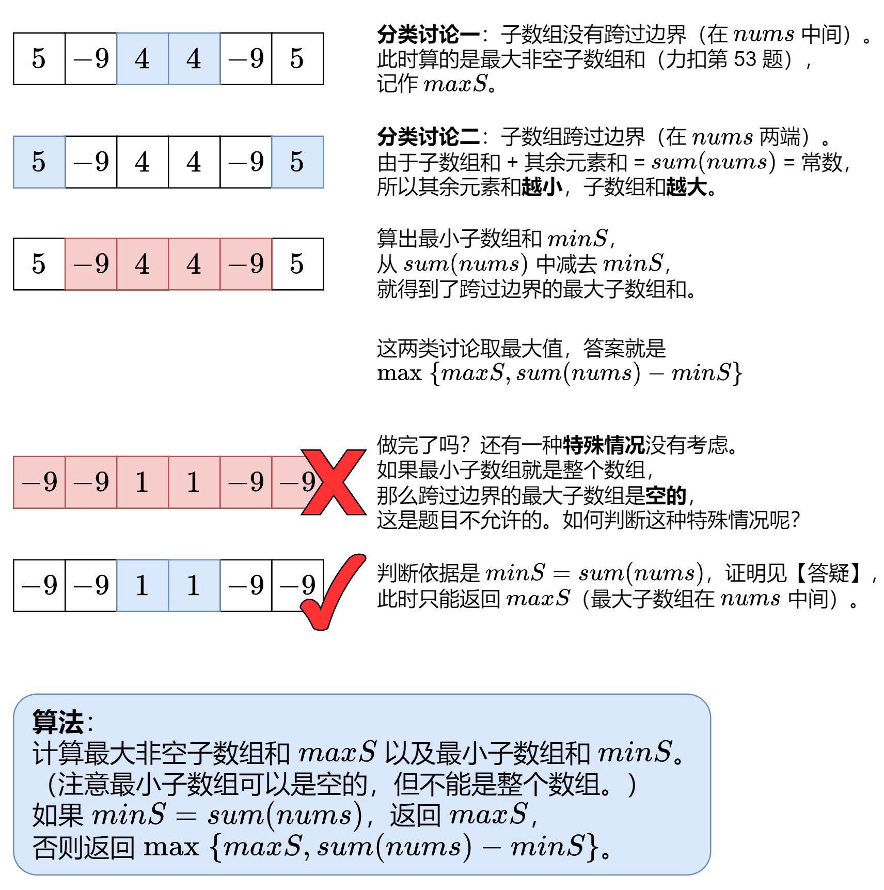

```python
def maxSubarraySumCircular(self, nums: List[int]) -> int:
    dp_max = [0 for i in range(len(nums))] # 以i结尾的最大子数组和
    dp_min = [0 for i in range(len(nums))] # 以i结尾的最小子数组和
    dp_max[0], dp_min[0] = nums[0], nums[0]
    max_sum, min_sum = nums[0], nums[0]
    for i in range(1, len(nums)):
        if dp_max[i-1] > 0: # 之前累积的>0
            dp_max[i] = dp_max[i-1] + nums[i] # dp_max可以从前一位加上来
        else:
            dp_max[i] = nums[i] # 从当前开始
        max_sum = max(max_sum, dp_max[i])

        if dp_min[i-1] < 0: # 之前累积的<0
            dp_min[i] = dp_min[i-1] + nums[i] # dp_min可以从前一位加上来
        else:
            dp_min[i] = nums[i] # 从当前开始
        min_sum = min(min_sum, dp_min[i])

    if min_sum == sum(nums): # 特殊情况
        return max_sum
    return max(max_sum, sum(nums)-min_sum) # 情况1和情况2的最大值

```
