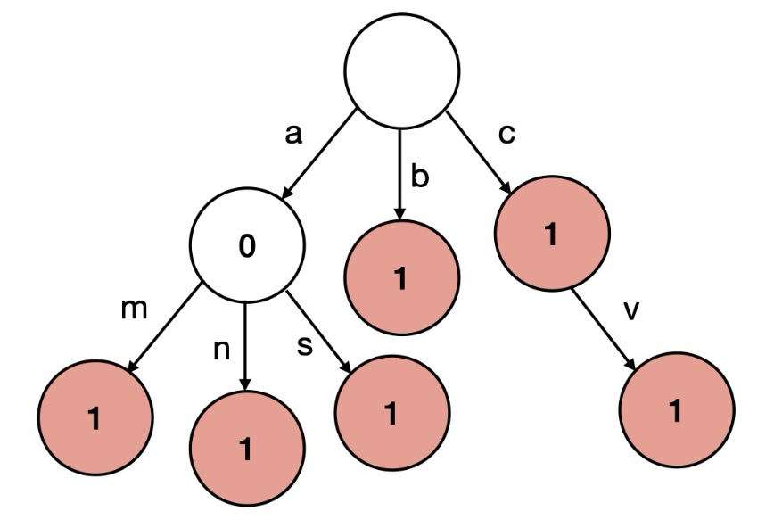

# Trie

## [208. Implement Trie (Prefix Tree)](https://leetcode.com/problems/implement-trie-prefix-tree/)（实现前缀树）

> 题意：实现字典树（前缀树）
>
> 思路：字典树模板题
>
> 
>
> Python 解法中，保存 孩子节点 是使用的字典，它保存的结构是 `{'a': {...}, 'b': {...}, 'c':{...}} `，所以可以直接通过 `node['a']`来获取当前节点的 `'a'`子树。
>
> - 叶子结点的 `node['#'] = {}`

```python
class Trie:
    # 字典树模板题
    def __init__(self):
        self.root = {} # root不存实际的东西，只存儿子节点

    def insert(self, word: str) -> None:
        node = self.root
        for c in word:
            if c not in node: # 找到了c
                node[c] = {} # 嵌套字典
            node = node[c] # 到儿子节点
        node['#'] = {} # 加上结束符

    def search(self, word: str) -> bool:
        node = self.root
        for c in word:
            if c not in node: # 找不到节点，就返回False
                return False
            node = node[c] # 获取儿子节点
        if '#' not in node: # 如果最终节点，没有结束符，也返回False
            return False
        else:
            return True

    def startsWith(self, prefix: str) -> bool:
        node = self.root
        for c in prefix:
            if c not in node:
                return False
            node = node[c]
        return True # 只要搜到了，不管有没有结束符，都返回True

# Your Trie object will be instantiated and called as such:
# obj = Trie()
# obj.insert(word)
# param_2 = obj.search(word)
# param_3 = obj.startsWith(prefix)
```
